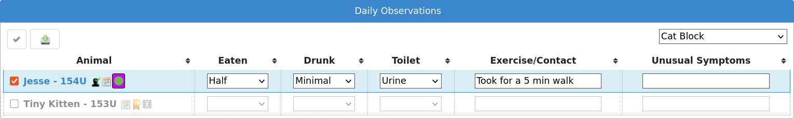

Animals
=======

Shelter View
------------

.. image:: images/shelterview.png

The shelter view screen (available from the default quicklinks or under
:menuselection:`ASM --> Animals --> Shelter View`) gives you an overview of all
the animals currently on your shelter, broken down by their internal location. 

You can use this screen to jump straight to an animal's record. You can also
drag and drop animals to move them between locations quickly. If you have
assigned units to the animal (for cage/pen numbers, etc) they will appear next
to their name. 

A dropdown in the upper right corner allows one of many different modes to be
applied.

There are also special modes to show animals in foster homes, either all
available homes with those with space highlighted (identified by the capacity
field), or all active foster homes only.

The "Location" modes mostly put animals who are fostered into a special virtual
location called "Foster" so that they are separated from your internal locations.
There is a mode named "Location (No Virtual)" that does not have this behaviour and
shows animals as in the location that they left from if they are on foster, trial
adoption or at a retailer.

A special "status" mode separates animals who are adoptable from those who are
marked not for adoption, those that are reserved and those that are
quarantined, held, cruelty cases or other indicators that they should not leave
the shelter.

Location and Unit mode
^^^^^^^^^^^^^^^^^^^^^^

The "Location and Unit" mode will show a box for every unit (units are
generally, pens, cages, kennels or runs etc) with the animals occupying them.
If a unit is unoccupied, it will be displayed with a green highlight to show it
is available. You can drag and drop animals between units in this view to
move them around.

.. image:: images/shelterview_reserved.png

An edit icon to the right of the unit's name allows you to reserve or sponsor
a unit. Reserved units appear in red to indicate they are not available. The
reserve text entered will be shown.

.. image:: images/animal_unit_reserved.png

Units are also shown as reserved when choosing a unit on the animal editing
screens.

If an animal is in a sponsored unit, the UNITSPONSOR attribute will be set
to the sponsor text in its data when retrieved via the Service API for your
website. It will also be available in the $$UNITSPONSOR$$ token for HTML
publishing templates. This allows you to show the sponsor of a kennel/pen
with the adoptable animal who is in it.

Find Animal
-----------

ASM has multiple methods of finding animals. The default is the simple screen: 

.. image:: images/findanimal_simple.png

From the single search term, this screen searches all aspects of the animal,
including codes, names, breeds, microchip numbers, original owner details,
media and movements. Animals are shown irrespective of where they are (the
location field displays where the animal is) or whether or not they are dead.
When you use the system search box at the top with an a: filter, the simple
animal search is what gets performed.

For example, searching for “black” would return animals with black in the name,
animals that are black in colour, animals adopted to an owner with the surname
black, etc. Results are sorted by relevance, so if the term appears in an
animal's name or code, it will be at the top of the list.

By clicking the Advanced button, you can go to a more sophisticated search
screen that allows you to search by animal location and state, age, etc.  You
can change which find animal screen is shown by default under the
:menuselection:`Settings --> Options` menu.

.. image:: images/findanimal_advanced.png

The Advanced screen allows you to enter detailed searches for groups of animals
within your database. 

If you press the search button without entering any criteria, you will get a
list of all animals on the shelter. This is because the
location box defaults to “On Shelter” - if you change this to “(all)” you will
get all animals wherever they are. 

Once you press the search button, ASM will search through your database and
check each record against any criteria you have chosen, and return to you a
list of all those that matched. For example, you could quite easily search for
all animals of species “Dog” who are still on the shelter, located in a
particular location and under 6 months old. 

The criteria fields follow one of three types: 

* Drop Down Boxes: You should select something from the list or the “(all)”
  entry to specify that you do not want to filter by this criteria. 

* Text Boxes: The system expects you to type part of a word, name or code etc.
  For example, typing “ben” in the “Name” box on the find animal screen will
  return all animals who have “ben” somewhere in their name - eg: Ben, Benji,
  Benson etc. Some boxes require numbers - the “aged between” boxes require an
  animal age expressed as a year, or fraction of a year. Entering 0 in the
  “From Age” box and 0.5 in the “To Age” box will return animals who are six
  months old and younger. 

* Filter: The filter dropdown allows selection of a number of options at the
  same time, such as only including animals that were transferred in from
  another organisation or housetrained.

Edit Animal
-----------

The animal screen is the one you will certainly use the most often within the
system. Across the top, the animal screen has a banner with important
information about the animal.

Below the banner, the animal screen is split into a number of different tabbed
sections. Clicking these tabs makes that area of the animal active. Because not
all of the information is mandatory or applicable to every animal, some of the
tabs will show a graphic to highlight that they have information (the graphic
varies according to what type of data is available on that particular tab). 

Animal Details
^^^^^^^^^^^^^^

.. image:: images/animal_details.png

The animal details tab contains all the basic information about the animal,
including it's breed, species, name, age, location within the shelter,
identifying code etc. 

A number of flags are available from a dropdown, including “Non-Shelter
Animal”.  Set this flag if the animal is nothing to do with your shelter, but
you want to utilise ASM's facilities in managing vaccinations, registering
microchips, etc.  This is very useful for shelters that run their own clinics
which are open to members of the public. Non-shelter animals are also useful in
combination with the courtesy listing flag, which allows you to manage adoption
listings for other shelters or owners without having those animals in your
figures.

You can also set a “not for adoption” flag, which enables you to hide this
animal from the internet publishers. Using the Hold and Quarantine flags will
also hide the animal from publishing and add an emblem (a little icon) when you
see the animal.

If the “Use Single Breed Field” option is not enabled in the system options
(the default), then ASM will display two breed fields with a “Crossbreed” flag
you can set. This allows you to choose two breeds for mixed/crossbreed animals.
The details page is subdivided into a number of accordion panels to categorise
the details. If you have created additional fields for animals under
:menuselection:`Settings --> Additional Fields` then the “Additional” panel
will appear.

The “Share” button can be used to publish the animal to various social media
sites. A link to a publically viewable version of the animal record will be
posted. How that viewable page looks can be tailored by editing the "animalview"
template under :menuselection:`Publishing --> Edit HTML publishing templates`

.. image:: images/unsaved.png

Details are treated like a document and when viewing, you get a personal copy.
Any changes you make aren't effective until you hit the Save button on the
toolbar. If you try to leave the details screen without saving changes, you
will be prompted.

Entry
^^^^^

.. image:: images/animal_entry.png

The Entry section contains all the information about how the animal originally
entered the shelter, including their background history and the names of the
original owner and person who brought the animal in. 

When adopting animals out, the system uses this information to track owners who
have brought animals into the shelter previously and to warn staff before
adopting animals to them. 

The bonded with fields allow you to specify upto two animals that this animal
can be bonded to. Bonding checks that when the animal is adopted, it is adopted
with its bonded partner(s). 

Most importantly, the right hand side of the screen contains the animals
original date of entry to the shelter. This date is used when generating animal
figures and auditing reports. 

If you are using a US locale, you will also see Asilomar categories. These
allow ASM to generate Asilomar figures for your shelter. Asilomar statistics
are a standardised way of calculating euthanasia figures for animal shelters
across the US. More information on them can be found here:
http://www.asilomaraccords.org/

Entry History
^^^^^^^^^^^^^

.. image:: images/animal_entryhistory.png

By default, the Entry section contains the original information of the animal's
first intake to the shelter and movements/returns are used thereafter to track
animals returning to the shelter.

For most shelters and rescues, this is fine, but some organisations want to
enter that data again for repeat visits and generate a new shelter code
for the animal.

If you have the option unticked for :menuselection:`Settings --> Options -->
Remove --> Remove the entry history section from animal records` then the
system will allow you to archive the information on the Entry slider to Entry
History so that entry information can be entered each time the animal returns to the
shelter. 

This can be done with the "New Entry" button on the toolbar. 

Clicking the New Entry button does the following:

* Takes a copy of all the information on the Entry slider and adds a row to
  Entry History (making the section appear if it is the first history record).

* Generates a new shelter code for the animal.

* Copies the returning person, reason and date from the latest returned 
  exit movement on file to the Entry section ready for updates to be made.

* The "Date brought in" field will become read only and show the last time
  the animal returned to the shelter. 

.. note:: The "New Entry" button will only appear on the toolbar if the animal has at least one returned exit movement on file and there are fewer entry history records than returned exit movements.

Health and Identification
^^^^^^^^^^^^^^^^^^^^^^^^^

.. image:: images/animal_health.png

The health and identification section is used for entering general information
about the animal's health and veterinary care. The special needs box can be
used to indicate that the animal has an ongoing or permanent health problem.
Ticking this box will flag this when publishing to the internet and to services
like PetFinder. 

Death
^^^^^

.. image:: images/animal_death.png

The death section is used for capturing information about the animal's death if it
is deceased. The most important field is the deceased date, as a value in this
field is used by the system to indicate that the animal is dead. 

In addition, an icon will be shown at the side of the death tab if the animal
is dead. The animal's location will also appear as Deceased with the reason.
The reason will be shown as "Died off shelter" if the animal was not in the
care of the shelter at the time of its death, and the death will not be
included in any figures or reports.

Diet
^^^^

.. image:: images/animal_diet.png

The diet tab is used for capturing information about the animal's diet. You can
set up as many different diet types (under :menuselection:`Settings --> Lookup
Data --> Diets`) as you like, and then log them here when the animal's diet
changes. 

Costs
^^^^^

.. image:: images/animal_costs.png

The costs tab allows you to track costs associated with looking after an animal
whilst it is in your care. You can assign a daily boarding cost, and ASM will
automatically keep track of how many days the animal has been on your shelter
and how much it has cost.

In addition, you can add cost types through the :menuselection:`Settings -->
Lookup Data --> Cost Types` menu and allocate costs for anything else your
shelter has spent on the animal (eg: Microchipping). Vaccinations and medical
treatments have a cost field that you can set for each treatment and they will
be automatically totalled up at the bottom of the costs screen along with a
current running cost for all time and a balance, calculated from total costs
less any donations allocated to the animal.

By default, when the animal is adopted, ASM will automatically convert the
current boarding cost/time into a separate cost record so it can be preserved. 

Vaccination
^^^^^^^^^^^

.. image:: images/animal_vaccination.png

The vaccination tab is used to track information about any vaccinations an
animal requires. An animal can have an unlimited number of vaccination records.
For complicated, multi-diary procedures, see Diary Tasks, covered later on.

Use the toolbar to create and modify items in the list. You will be reminded of
outstanding vaccinations via the alerts on the home page, or by viewing them
under :menuselection:`Medical --> Vaccination Book` 

Vaccinations can also have a cost attached for use with reporting. The cost is
for the individual vaccination. 

Vaccinations have three date fields:

* Required: This is the date that the vaccine is due to be administered to the animal
* Given: This is the date that the vaccine was actually administered to the animal
* Expires: This is the date that the vaccine "wears off" and needs to be administered again.

Due vaccinations for the purposes of reporting, alerts and the medical book are
those that have a required date, but no given date yet.

Expires is a "belt and braces" reminder. The system expects you to set the
expires date when you don't expect this vaccination to be given again during
the animal's stay with the shelter - eg: a booster vaccination that won't be
given again for a year. It means the system can remind you a new vaccination
needs administering in the unlikely the event that the animal is still in the
care of the shelter when the date arrives. To get rid of the alert for an
expired vaccination, create a new required vaccination for that animal of the
same type.

Test
^^^^

.. image:: images/animal_test.png

The test tab is used to track information about any medical tests an animal
requires. An animal can have an unlimited number of test records. 

Items in the test list are saved immediately to the database when you hit the
Save button in the popup screen. You will be reminded of tests falling due via
the Test Diary report, main screen alerts, or by viewing them under
:menuselection:`Medical --> Test Book`

Tests can also have a cost attached for use with reporting.

Medical
^^^^^^^

.. image:: images/animal_medical.png

The medical tab is used to track information about medical treatments an animal
is receiving. It is extremely flexible in what it can track and it can handle
just about any kind of schedule. You can create medical profiles from
:menuselection:`Medical --> Medical Profiles` and use these as templates for
treatment records. 

Treatment records are automatically created from regimens. You can edit the
regimen by clicking on the treatment name.

As you complete each treatment, ASM will generate the next record in the
sequence, until there are none left and the medical record is automatically
completed (unless the treatment has an unspecified end, in which case ASM will
continue to keep creating treatments until the animal dies).

You can view all outstanding medical treatments at any one time by visiting
:menuselection:`Medical --> Medical Book`, you can also print currently
outstanding treatments from here.

Medical records can also have a cost associated with them for reporting. The
cost is for the whole medical item (ie. If it's a course of tablets, then the
cost should reflect the whole cost of all tablets required for the medical, it
is not per individual tablet). 

Media
^^^^^

.. image:: images/animal_media.png

The media tab contains documents, images, PDF files and links that have been
stored with the animal. 

The most common use is for images. Click the attach file button to attach a new
file to the animal. When you attach files, they are stored with the animal and
you no longer need the original file. Since images are the most common use, the
file browser will display previews of images, and if you click an image in the
media list, it will be viewed full screen.

The image button menu on the toolbar allows you to transform and manipulate
various properties of the image. You can rotate it, convert it to a PDF
document (useful for taking photos of paperwork), exclude it from being sent to
your website or third party websites and watermark the image.

Watermarking is a process where your logo is copied to the lower right of the
image and the animal's name rendered over the lower left - this requires you to
upload your logo named watermark.png to :menuselection:`Settings --> Reports
--> Extra Images`

If the content is a PDF, you can click it to have your browser view it. If the
content is an HTML document, then clicking it will open it with ASM's built in
word processor for editing and printing.

One or more media elements can be emailed from here.

HTML documents can be emailed as a PDF and signed. The Sign button menu allows
you to sign on screen with a pen/mouse device, send the document to the mobile
signing pad or send an email to someone with a request to sign the document.

You can also attach document and video links (for example, to Google Docs or
YouTube videos). Video links and images can have a default set for publishing
purposes. If you have the “publish all images” turned on in your publishing
options and an animal has multiple images, you can individually choose which
ones will be published with the tick/cross icon next to the image icon.

Giving an animal the “Not for adoption” or "Not for publishing" flag on the
details tab will ensure that the animal is not included in any website
publishing.

Notice that when an animal has media, the tab displays a graphic, indicating
there is data under this tab. 

Diary
^^^^^

.. image:: images/animal_diary.png

The diary tab shows a list of all diary notes relating to this particular
animal. From here you can create new diary notes, as well as modify existing
ones.

Transport
^^^^^^^^^

.. image:: images/animal_transport.png

The transport tab shows a history of where the current animal has been
transported to (particularly useful for rescues who have volunteer drivers
taking animals to vets from foster homes). Transport can be scheduled and
reports exist to find new transports without a driver, etc.

Movements
^^^^^^^^^

.. image:: images/animal_movement.png

The movement tab shows a summary of all movements that the animal has
undergone. An animal can have an unlimited amount of movements and the movement
tab has its own special toolbar. From here, you can create new movements and
jump straight to the owner records for existing movements. 

Log
^^^

.. image:: images/animal_log.png

The log tab is used for logging additional useful information. You can create
as many log types as you want under :menuselection:`Settings --> Lookup Data
--> Log Types`. You can then create a log entry with a given type for a date
and with a comment. This is useful for keeping track of animal weights, bite
reports, owner emails, complaints and anything else you can think of. 

Template Animals
----------------

It's quite common for shelters to want to assign certain elements to new
animals. Whilst defaults for all the dropdowns can be assigned under
:menuselection:`Settings --> Options --> Defaults`, it's normal to want to
be able to assign a set of vaccinations, medical treatments or tests, 
or a particular diet, or some standard costs to new animals.

To do this, create a new animal record with the vaccination, medical treatments,
diets and costs on that you'd like to be assigned to new animals. Make sure that
the "Non-shelter" box is ticked so that this template animal is kept away from
all reports and figures. Finally, give it the name "TemplateType" or 
"TemplateSpecies". 

If you name the animal TemplateType, the system will look for your template
animal when the type of the new animal matches it. Similarly, the species has
to match if the template is called TemplateSpecies. Type is preferred over
species so if you have a new animal where the type and species match two
different templates, the type will "win" and the new animal will get the
records from the matching type template.

Where records require dates (for example, the due date on medical treatments or
vaccinations), the system will calculate the new date based on the difference
between the date brought in field of the template animal and the due/required
date of the cloned records in question.

For example:

* Template brought in date: 1st January 2016
* Required date of a vaccination on that template: 10th January 2016
* Day difference: 10 days
* Required date of that vaccination when added to the new animal will 
  be today + 10 days

If the calculated date is in the past, today will be used instead.

When copying from a template animal, ASM will copy the following items to your
new animal record:

* The animal's adoption fee amount and description/bio field
* The animal's current vet
* The Hold, Is Not Available For Adoption and Do Not Register Microchip flags
* Any additional flags the shelter has added to the system
* Any additional fields the shelter has added to the system
* Vaccinations
* Tests
* Medical regimens
* Diets
* Costs
* Diary notes

Baby Animals
^^^^^^^^^^^^

In addition, you can further define a template animal that will only be applied
to baby animals. If the animal's age is under the system default defined "baby
split" of 6 months, the system will first look for template animals named
TemplateTypeBaby and TemplateSpeciesBaby before falling back to TemplateType
and TemplateSpecies if they do not exist. 

Precedence
^^^^^^^^^^

If there are TemplateType and TemplateSpecies matches for the new animal,
TemplateType will be used. If there are multiple templates of either
TemplateType or TemplateSpecies that match (eg: 2 TemplateSpecies animals on
file with species=Cat) then the first one to be entered will be used and the
later on ignored.

Calculating offsets from Date Of Birth
^^^^^^^^^^^^^^^^^^^^^^^^^^^^^^^^^^^^^^

The default behaviour is to have the system calculate the date offset based on
the difference between date brought in and the current item, then add it to the
date brought in on the new record. 

If you would prefer to calculate the offset based on the date of birth and the
current item, with it similarly being added to the date of birth on the new
record, then you can do this by appending DOB to the template animalname, eg:
TemplateSpeciesBabyDOB to calculate on date of birth for a template that
applies to baby animals based on species.

This feature is particularly useful for vaccinations and other medical
treatments (eg: first worm/flea treatment, spay/neuter etc) that are first
given to juvenile animals at a fixed age rather than based on when they entered
your care.

Bulk Change Animals
-------------------

.. image:: images/animal_bulkchange.png

The bulk change screen allows you to select one or more shelter animals and
set one or more fields to the same value. This is very useful for making
a group of animals not for adoption in one go, applying a flag, or 
moving them all to a different location. 

This screen also allows you to create a new log message to be applied to all
the selected animals, or to create a new movement for all animals (eg: a fake
adoption to get the selected animals off shelter, or if a group are all being
transferred to another organisation).

Finally, the delete button on this screen allows you to bulk delete all of
the selected animals. Use this option with caution. 

.. _dailyobservations:

Daily Observations
------------------

The daily observations screen offers a quick way of writing structured log
messages to animal records. 

Use the dropdown at the top right to filter shelter animals by their current
location.

Tick the checkbox against each animal that you wish to write an observation
for, then update the text/dropdown fields with your observations. When you are
done, the save button on the toolbar will record a log message containing the
values for all selected animals. 

You can edit the observation values that are requested under
:menuselection:`Settings --> Options --> Daily Observations`

Litters
-------

Animal Shelter Manager allows you to track litters as they are born (or come
into) the shelter. These facilities are used in particular for generating the
monthly animal figures report, where the number of litters on shelter for each
day of the month is tracked.

.. image:: images/litters.png

The main screen is accessible from :menuselection:`ASM --> Animals --> Edit
Litters`. It shows you a list of all currently active litters on the shelter. A
litter is deemed active whilst it has no expiry date, or an expiry date later
than today.

If an animal is returned from adoption who was part of an expired litter, the
litter will not be resurrected and it will remain expired unless you manually
remove the expiry date.

The litter holds information about how many animals collectively made it up,
who the mother was (if known), what species of animal the litter is and any
comments.

.. image:: images/litter_add.png

Auto Expiry
^^^^^^^^^^^

The system will check all the animals in the litter as part of the overnight
batch, and the litter will be automatically given an expiry date in the
following scenarios:

* There are no animals who make up the litter left in the care of the shelter

* The animals in the litter are older than 6 months

