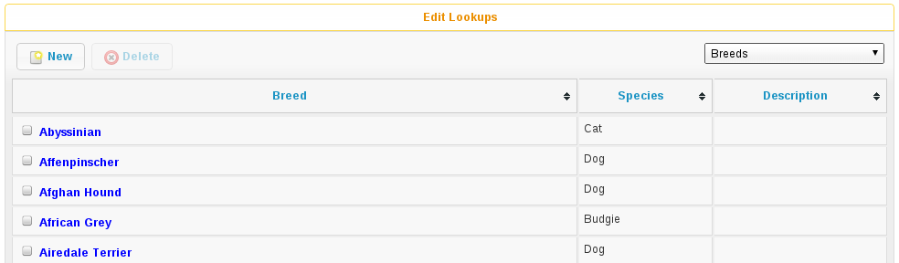
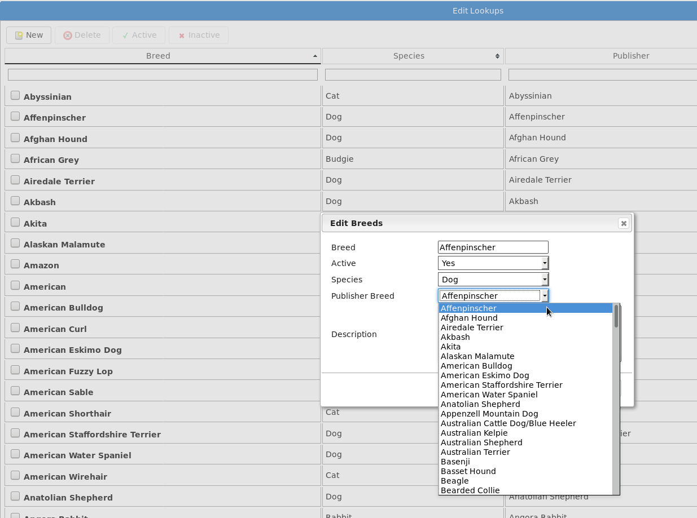
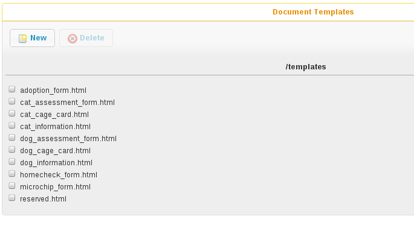
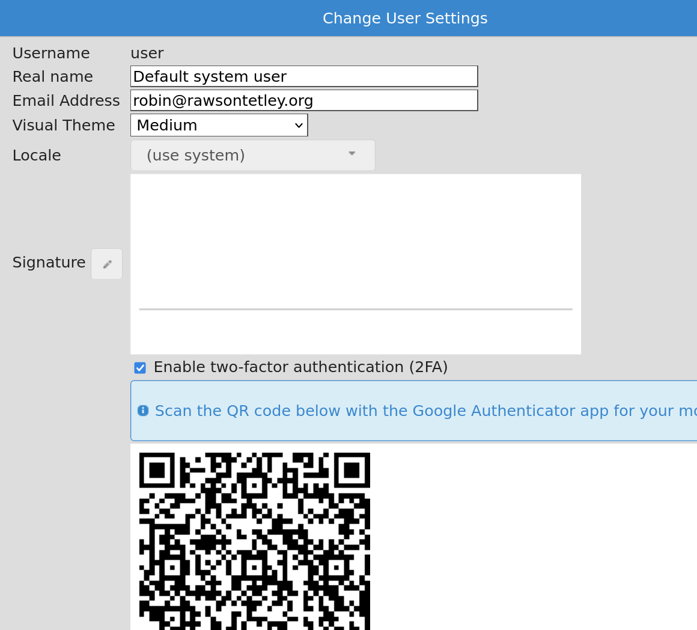
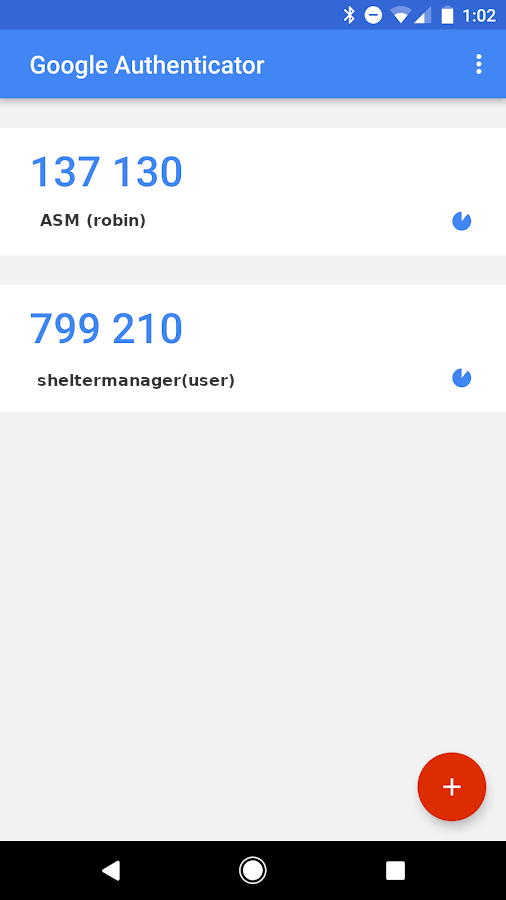
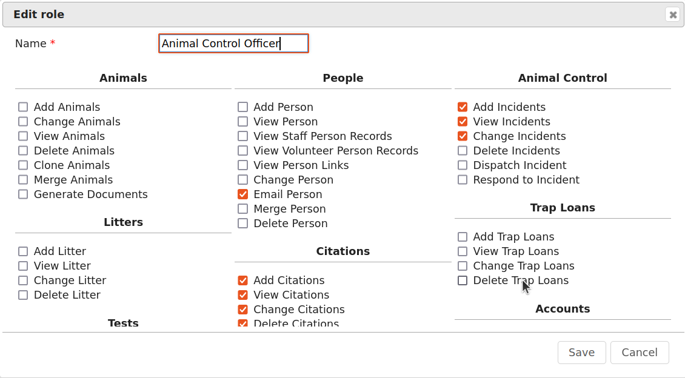
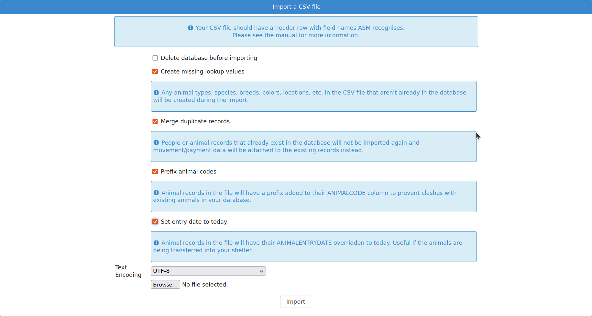

Configuration
=============

To configure all areas of the system, you need to look under the top-level Settings menu. 

Additional Fields
-----------------

.. image:: images/additional_fields.png

This screen allows you to declare additional fields that will appear on the
animal, person, lost animal, found animal and waiting list screens.

Fields have a name, a label, a tooltip, a location, a display index and a default
value.

The name cannot contain spaces and is used for referencing the data in document
generation - you can use a <<FIELDNAME>> tag to add these additional values to
your documents. The label is what will appear on the screen at the side of the
field, the tooltip text will appear when you hover your mouse over the control
on screen. The display index determines the order your fields are output to the
tab and which field the cursor moves to when you press the TAB key on the
screen. The default value will populate the field automatically until it is
updated.

If you selected a field type of “lookup” or “multi-lookup”, then the use the
“Lookup Items” field to supply some values for the dropdown list. These should
be pipe-separated, eg: Item 1 | Item 2 | Item 3 

If you selected a field type of “Yes/No” then “Lookup Items” can optionally
hold a pair of values that ASM will use. You can use this to supply your own
text for Yes/No fields in the web publisher and document templates. The default
if you don't supply a Lookup Items for a Yes/No field is 0=Yes|1=No 

The "show on new record screens" checkbox makes the field available on the new 
record entry screen the field is linked to. For example a field created which 
is linked to Animal-Entry will appear in the entry section when adding a new 
animal if the checkbox is enabled.

The mandatory checkbox allows you to mark a field as mandatory (ie. Will not
let a user save until they have supplied a value). Mandatory additional fields
will appear on the new screen for a record where non-mandatory ones do not.

The searchable checkbox allows you to include the additional field in global
searches using the search box at the top right of every screen. Pay careful
attention to your use of this as unnecessarily marking fields searchable can
slow things down. It's best generally to only make an additional field searchable
if that field contains a unique string to identify the record (for example,
Driving Licence ID).

The hidden checkbox will hide the field from users so it can no longer used. This 
is usefull when you no longer want a field to be used but don't wish to delete the 
field from the system, as deleting an additional field from the system also deletes
all the data it held. 

Here's a worked example: To add a new field to the animal screen to say whether
the animal has been tested for kennel cough, create a new additional field and
enter the following values::

    Name: KennelCough 
    Label: Kennel Cough Tested? 
    Tooltip: Tick this box if the animal has been tested for kennel cough 
    Show on new records screen: No
    Mandatory: No
    Searchable: No
    Hidden: No
    Type: Yes/No 
    Link: Animal - Additional
    DisplayIndex: 0 

The new field will appear under the Additional tab on the animal screen. 

You will be able to reference it in generated animal documentation with the
<<KennelCough>> key. 

Data for these fields is stored in the “additional” table in the database, the
LinkID field holds the animal or person ID (with LinkType being the location, 0
is animal additional tab, 1 is person additional tab).

You can access additional fields in reports by using a subquery. For example,
to output a list of all our animal names with the new KennelCough field we
defined::

    SELECT a.AnimalName, 
        (SELECT ad.VALUE FROM additional ad 
         INNER JOIN additionalfield af ON af.ID = ad.AdditionalFieldID 
         WHERE ad.LinkID = a.ID AND af.FieldName = 'KennelCough') AS KennelCough
    FROM animal a

Lookup Data
-----------

The lookup data screen allows editing of lookups. These are small, standard
tables of information used throughout the system for values such as breeds,
species, colours, flags, sizes, vaccination types, etc. 

As well as creating and deleting them here, lookup data items can be marked
inactive so that they cannot be chosen for new records, but are retained for
compatibility with existing records.

Some lookups, such as breed, species and color allow you to choose a matching
"Publisher" item. These are the items that will be sent to AdoptAPet, PetFinder
and other third party adoption sites when transmitting adoptable animal data.

Document templates
------------------

Here, you can edit the available document templates on the system. For a
comprehensive list of tokens for use in templates, see the appendix on
wordkeys.

Reports
-------

.. image:: images/reports_edit.png

Here, you can create and edit all the available reports on the system. The
“Browse sheltermanager.com” button allows you to browse reports from the online
repository and choose reports, graphs and mail merges to install. 

The “Edit Header/Footer” button allows you to modify the HTML header that is
prepended and footer that is appended to reports when they're run.

Extra Images
^^^^^^^^^^^^

The “Extra Images” button allows you to upload additional images for use in
reports and document templates. The screen will give you a URL for each image
so you can reference them in reports and document templates.

There are certain special names for images that the system will use to override
some of its standard pictures:

* nopic.jpg – this is the image the system will display when an animal does not
  have any image media. You cannot delete this image, however you can upload a
  new image called nopic.jpg to replace it.

* logo.jpg – this is the image the system will use for the home logo at the top
  left corner. By default, it's the ASM logo but it can be changed for your
  shelter. Ideally, your logo should not be more than 32 pixels high, but the
  system will scale down larger images.

* splash.jpg – this is the image the system will show on the login screen
  instead of the default ASM splash screens. Your splash image should be
  400x200 pixels.

* watermark.png – this should be a version of your logo with a transparent
  background. If you supply a watermark image, then the watermark toolbar
  button will appear on animal media tabs. This button will add the watermark
  image to the bottom right of the chosen picture and the animal's name in the
  lower left. Note that the original image will be changed, so you should
  upload images multiple times if you want to retain a copy without the
  watermark.

System user accounts
--------------------

You may create, edit and delete system users from here. It is recommended that
every person who uses Animal Shelter Manager have their own login and user name
(when a user is finished, they should navigate to :menuselection:`User -->
Logout` to prepare the system for the next user) - simply to make sure that
people do not get other people's work attributed to them on the audit trails.

Whilst editing a user, you can choose absolutely everything that user may do
within the system by assigning one or more appropriate roles. If you set the
user type to "superuser", the user has full administrative privileges to the
system. If you choose "normal user", you will need to set permissions for
the user by assigning roles.

If you set an email address for the user and configure email, you can have the
system send diary notes and messages via email to users.

If you set a staff person record for the user, they will be forbidden from opening
that person record. The idea is to prevent them from viewing their own person
record. You can also set the role permission to forbid them opening any other
person record with the “Staff” flag if you wish to lock a user from opening any
staff person records.

Setting an IP restriction will only allow that user account to login from IP
addresses that match the set. IP restrictions should be separated with spaces
and can be either complete IPv4 of IPv6 addresses, IPv4 blocks in CIDR notation
or IPv6 prefixes. Eg:

   192.168.1.0/24 172.16.31.34 2001:db8:abcd:0012

Site and Location Filters
^^^^^^^^^^^^^^^^^^^^^^^^^

Setting a location filter (a group of internal locations) for a user account
will prevent that account from seeing or opening animals who are not in those
locations when:

* Directly viewing an animal record.

* Displaying animal links on the home page.

* Displaying shelter view, search results or find animal results (basic or
  advanced). 

* When adding or editing animals, the internal location dropdown will only show
  those locations.

* When choosing report criteria, they will only be able to select one of the
  filter locations for any $ASK LOCATION$ tags.

If ASM has been configured with multi-site mode, a site dropdown will also
appear on the user record, allowing a site to be assigned to the user. Each
internal location belongs to a site and selecting a site is effectively a
shorthand for setting a location filter for all the locations that belong to
that site. It is an easy way of preventing a user from seeing animals who are
not at that site without having to configure individual location filters.

There are a number of "special" location filters, which correspond to
animals outside the shelter that you may wish to let your users see.

They all appear at the bottom of the list and allow you to choose from animals
who have a particular exit movement type, those who are marked non-shelter,
those who the active user is fostering or coordinating adoptions for right 
now and deceased animals.

.. _Two-Factor Authentification:

Two-Factor Authentication (2FA)
^^^^^^^^^^^^^^^^^^^^^^^^^^^^^^^

ASM supports two-factor authentication for user accounts with the Google
Authenticator app (or any time-based one time password generator) 
for mobile devices. 

To enable it, log in with your user account, then choose "Change User Settings"
from the user menu at the top right of the screen (the button with your
username on it).

Install the Google Authenticator (or other TOTP) app on your mobile device from
the Play or iTunes store. Tick the box to enable 2FA and the screen will show
you a QR code. In the Google Authenticator app, click the add button and choose
"QR Code", then scan the on screen code with your camera. 

An entry will appear in Google Authenticator for ASM (if you are self hosted)
or sheltermanager (for sheltermanager.com customers) with your username and a
time-based one time passcode that will update every 30 seconds. When you login
in future, you will be challenged for this 2FA code from your mobile device. 

If you are ever locked out of your account because your mobile device is no
longer available, you can disable 2FA by resetting your password from either
the login screen, or via :menuselection:`Settings --> System user accounts`

User roles
----------

Roles can be assigned to individual users and represent sets of permissions.
When you edit a role, ASM will show you a huge number of tickboxes to determine
what any user with that role is allowed to do within the system.

Export Animals as CSV
---------------------

ASM can export your animal data to a CSV file. This format of CSV file is the one
used by the "Import a CSV file" screen. You can use this function to export data
to a file that you can give to other ASM users to import into their database.

A number of pre-set filters are available. You can choose to export all animals
in your database, those who are currently on the shelter, a selection
of the current on shelter animals or use custom SQL.

Export People as CSV
--------------------

ASM can export your person data to a CSV file. This format of CSV file is the one
used by the "Import a CSV file" screen. You can use this function to export data
to a file that you can give to other ASM users to import into their database.

A number of pre-set filters are available. You can choose to export all people
in your database, those with a particular flag or use custom SQL.

Import a CSV file
-----------------

ASM can import data from a CSV file. 

Microsoft Excel, OpenOffice Calc, Gnumeric, Google Docs and many other
spreadsheet products can all export individual sheets in CSV format.

.. note:: The screen :menuselection:`Settings --> Export Animals as CSV` produces CSV files in a format that ASM can import. This can be used to export and import animals from one ASM database to another.

The CSV file should have a header row that contains column names that ASM
recognises (see :ref:`csvimportfields`)

.. image:: images/sample_csv.png

Each row of data can contain animal, person, movement and donation information.
If movement data is present, then an adoption (or other movement if
MOVEMENTTYPE is set) record will be created to link the animal and person in
the row together. If donation data is present in the row, a donation will be
created and linked to the person (and movement if one was available).

If a column is not supplied, then ASM will use the default as set under the
default tab in Settings-Options. For example, not setting ANIMALTYPE will cause
ASM to use the default animal type.

ASM prefers the ANIMALDOB field to set the date of birth, but if you don't have
it, it will calculate the date of birth from the ANIMLAGE field (which it
assumes to be an integer number of years). If neither are set, it will use
today's date as a last resort.

If ANIMALBREED2 is not set, the animal is assumed to be a purebreed of
ANIMALBREED1. If ANIMALBREED2 is set and is different from ANIMALBREED1, then
the crossbreed flag will be set on the resulting animal.

When importing animals and people, ASM will check the database for animals
with the same ANIMALCODE and people with the same name/address or email/cell 
phone to find duplicates. Certain fields (see :ref:`csvimportfields`) will
be updated if an existing record is found and a new record will not be 
created. 

If the “Create missing lookup values” option is on, and the file contains a
value that is not present in the database (for example, if you have “Goldfish”
in the ANIMALSPECIES column, but it isn't a species in your database), then it
will be created during the import and the animal linked to it.

If the “Clear tables before importing” option is on, ASM will remove all data
from the animal, person, movement and donation tables before doing the import.
This delete cannot be undone, so exercise caution when using this option as you
can wipe out your entire database!

Import a PayPal CSV file
------------------------

ASM can import data from CSV files produced by PayPal's activity reporting.

The import process allows you to choose a payment type and method for the
imported transactions and any flags you'd like to assign to people records
created or updated as a result of the import. The import will use the person's
email or name and address to try and automatically attach payments to existing
person records where possible. If an existing record cannot be found, a new
person will be created.

The net amount will be used as the payment amount and the PayPal transaction
fee will be recorded with the payment.

It is possible to override the payment type on a per transaction basis by
editing the PayPal CSV file and adding a column named "ASM Payment Type". You
can then assign values from your payment types lookup in this column. Note that
they must match exactly (same case) the payment type name from your lookup. If
the column does not exist, contains a blank or the system could not find a match
then the payment type from the import screen will be used.

Import a Stripe CSV file
------------------------

Similar to PayPal, ASM can import data from CSV files exported with the Export
button on Stripe's payments screen.

The Stripe fee will be recorded with the payment and the payment amount will
have the fee deducted.

Trigger Batch Processes
-----------------------

ASM runs various tasks overnight to keep animal records upto date and generate
cached versions of complex reports and figures. 

Ordinarily, users should have no need to trigger these batch processes
manually, however after importing CSV data or making bulk data changes with
queries, animal locations, person flags and historic figures data can get out
of sync and need to be recalculated/regenerated.

Some of these processes can take many minutes to run and may block use of the
database for other users. They should be used sparingly.

