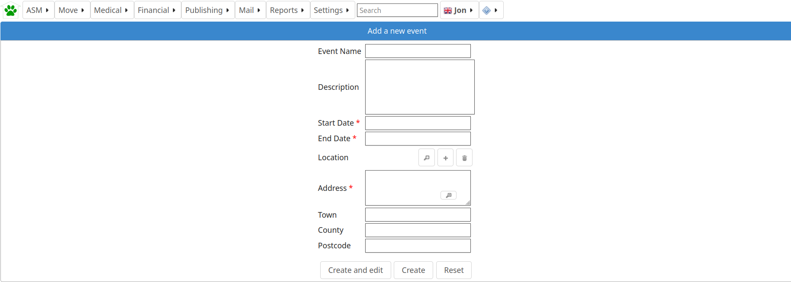
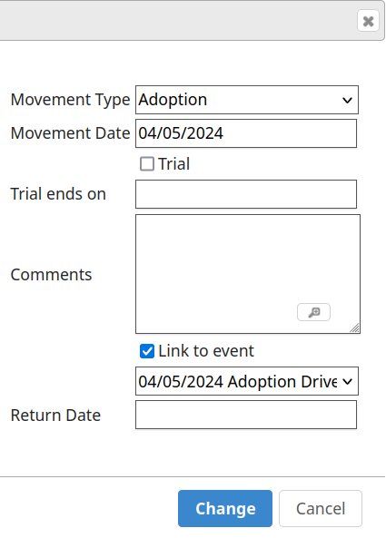
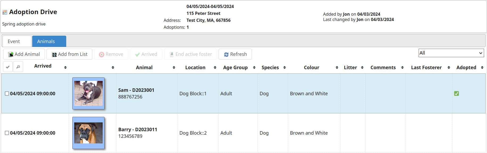

Events
======

ASM allows you to create events such as fundraisers and adoption drives. 
You can create and search for events in the events section of the ASM menu.

Animals can be added to events and a count kept of completed adoptions by 
linking the adoption movements to the event.

Events can be published to your website using the html_events service call, 
see :ref:`serviceapi`
