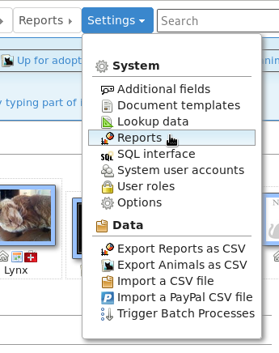
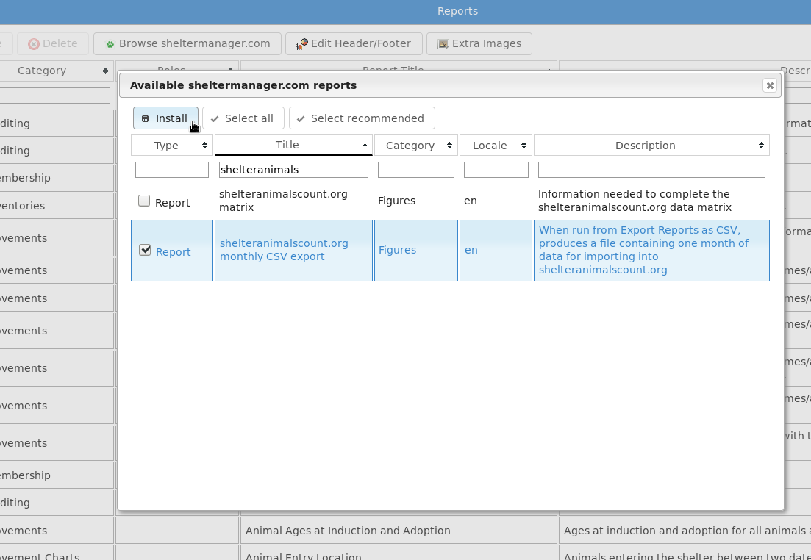
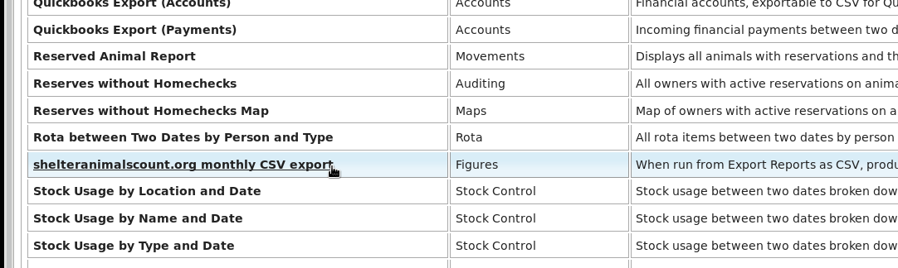

Appendix: Frequently Asked Questions
====================================

How do I add new vaccination types, breeds or internal locations?
-----------------------------------------------------------------

Go to :menuselection:`Settings --> Lookup Data`, and then choose them from the
dropdown list at the upper right side of the screen.

How do I bring an animal back to the shelter after adoption, transfer or fostering?
-----------------------------------------------------------------------------------

Open the animal's record and go the Movements tab. Find the current adoption,
transfer or foster movement, edit it and set a return date.

Where do I get some reports?
----------------------------

Go to :menuselection:`Settings --> Reports`, then click the "Browse
sheltermanager.com" button.  You can choose reports from the list and use the
"Install" button to add them to your database.

Why am I seeing "animal not in location filter/site" when I open a record?
--------------------------------------------------------------------------

You've applied a "location filter" to your account. A location filter is a list
of locations attached to a user account that prohibits the user from seeing
animals who are not in one of those locations. To remove it, go to
:menuselection:`Settings --> System user accounts` and remove the location
filter items from your account.

Why is my animal marked not available for adoption?
---------------------------------------------------

ASM assumes that any on shelter animal is adoptable, unless it has the "Not for
adoption" flag explicitly set on it.

There are then a set of rules applied to decide whether or not an animal is
excluded from being adoptable. You can edit those rules under
:menuselection:`Publishing --> Set Publishing Options --> Animal Selection`.
The rules can exclude animals that don't have a photo, are in a foster home or
part of a cruelty case, are under a certain age, etc.

If an animal is not adoptable due to any of those rules, when you view its
record, you will see the words "Not for adoption" in the banner at the top of
the record and directly underneath that in brackets the rule that has excluded
the animal from being adoptable.

Why are my non-shelter and adopted animals appearing on the vaccination book?
-----------------------------------------------------------------------------

The option :menuselection:`Settings --> Options --> Defaults --> Include
off-shelter animals in medical books and calendars` controls whether or not
off-shelter animals appear in the vaccination book, medical book, test book and
are highlighted in alerts on the home page. By default, this option is off. 

Why are my non-shelter and adopted animals being shown on my website?
---------------------------------------------------------------------

You've likely set the "Courtesy Listing" flag for that animal.

The purpose of that flag is to force animals that wouldn't normally be
adoptable to appear on websites and be sent to third parties for publicity.
Common scenarios for this are non-shelter owned animals or previously adopted
animals where the owner is handling the adoption, but the shelter is helping to
publicise the animal.

Why can't I edit the date brought in field?
-------------------------------------------

The option :menuselection:`Settings --> Options --> Animal Codes --> Once
assigned, codes cannot be changed` will cause the edit animal screen to lock
any fields that make up part of the shelter code. For example, if your coding
format contains T for the type, the type field will be locked for editing when
this option is on. If your coding format has any of YYYY, MM or DD for a
portion of the date brought in, that field will be locked too.

When I create a payment I get "No source account found for donation type, can't create trx"?
--------------------------------------------------------------------------------------------

You've turned on the option to have payments create matching accounting transactions
under :menuselection:`Settings --> Options --> Accounts`

The error is occurring because your payment type is not linked to an income
account under :menuselection:`Financial --> Accounts`. To fix this, either
disable the option to create matching accounting transactions if you are not
using the accounts. Or, you can create a new income account in the accounts
screen and link it to your payment type with the dropdown.

The message itself is only a warning to tell you an accounting transaction could not be
created, it is not stopping your payment from being created.

Why can't I view my person record?
----------------------------------

You've linked a person record to your user account. This should only be done when
you want to forbid a user account from viewing a person record and is there to 
prevent staff members from editing their own person records.

You can unlink the person record by going to :menuselection:`Settings -->Edit System Users`,
editing your user account and using the trash can icon to the right of "Staff Record"
to break the link. Breaking the link will not delete the person record or user account.

How do I integrate my adoptable animals with my website?
--------------------------------------------------------

See :ref:`websiteintegration`.

I uploaded the wrong picture for an animal, but it's "stuck"?
-------------------------------------------------------------

Your browser caches the thumbnail images for each animal. If you upload the
wrong picture, then delete it and upload the correct picture your browser will
continue to show the old picture. 

To fix this, invalidate your browser's cache when looking at the animal's
record by pressing :kbd:`CTRL+R` or :kbd:`F5` to reload all images from the
server. This does not work as well in some versions of Internet Explorer and if
you are using that, you can try :menuselection:`Tools --> Internet Options` and
delete temporary internet files.

Why do I get "page 1 of 1" in the header when I print documents?
----------------------------------------------------------------

Your web browser is adding these header and footers. Where you turn them off depends on your
web browser:

* Internet Explorer: Open Page Setup from the printer icon on the toolbar or
  File menu. Delete the header and footer strings in the "Headers and Footers"
  section

* Firefox: Choose Page Setup from the File menu (press ALT if it is not
  visible). Click on the Margins & Header/Footer tab and choose --blank-- from
  all the dropdowns in the Headers and Footers section.

* Chrome: Untick the "Print headers and footers" box in the print preview
  screen.

My scanned confidential documents are being published on my website / PetFinder!
--------------------------------------------------------------------------------

You've attached scanned documents as JPEG images to animal records. You should
NEVER do this!

* They can be published outside the shelter, which you do not want. 

* They aren't relevant to someone browsing an animal bio online.
  
* ASM scales down incoming pictures for the web, assuming any pictures you
  upload are always going to be photos of animals. This means smaller text on
  documents you scan as JPEG will become unreadable.

Instead, you should always attach your scanned documents as PDF files. ASM
scales PDFs in a different way so that they don't lose clarity and legibility,
it will never publish a PDF to any website.

If you're using phones rather than flatbed scanners to scan your documents,
apps exist for all mobile platforms that allow you to take a photo of a
document, clean it up and output it as a PDF. Apps such as "CamScanner" for
Android, or "Scanner App" for iPhone.

Why can't I send certain fields to PetFinder?
---------------------------------------------

PetFinder's import spec only allows for the following items of information to be
sent by ASM (or any third party system):

Code, Name, Breed, Mix, Sex, Size, Color 1-3, Age, Bio/Description, Type, Shots, Altered,
NoDogs, NoCats, NoKids, Housetrained, Declawed, SpecialNeeds, 6 x Photos, Arrival Date,
Birth Date, Special Needs Notes, Adoption Fee, Display Adoption Fee Y/N

Note that the spec only allows ASM to state whether an animal is bad with other
animals, but not if it is good with them. It also will not accept video URLs or
any other field that PetFinder have on their site that is not listed here.

While color is accepted by PetFinder, we do not support sending it. The reason
is that our color field is a single user customisable dropdown. PetFinder split
the color into 3 dropdowns of separate colors and have very strict validation
rules on which combinations are allowed for different species of animals. It is
therefore impossible to map our color scheme to theirs in a way that
won't cause many of your animal listings to be rejected.

Why are ASM emails being sent from account@bounce.sheltermanager.com?
---------------------------------------------------------------------

In the early days of email, address spoofing was used by everyone. It was
an easy way ensuring an email came back to you no matter what servers your
message passed through.

Unfortunately, this also made it easy for spammers to fake where their emails
were coming from and to send a lot of backscatter (failure notices) to innocent
victims.

Most large email services today, such as gmail, hotmail and yahoo use
technologies called SPF and DKIM. These allow a domain to state which mail
servers are allowed to relay email on its behalf. For example, the hotmail.com
domain states that nothing but the hotmail servers are allowed to send 
any messages that come from a hotmail.com address.

When a message arrives at an email server using these technologies, it checks
the domain the email is from and then checks to see whether the server it
received that message from is allowed to send email for that domain. If it
isn't, the message is put straight into the spam folder of the recipient or in
some cases, rejected outright.

This is very helpful in filtering spam, but it means that ASM cannot send
emails that appear to come from your address (particularly if you have a
hotmail or gmail address) - otherwise most mail services will either refuse
delivery of your message or put it straight in the spam folder for the
recipient. 

Instead, ASM sends emails from the fixed address you configured in sitedefs and
trusts you know what you're doing.  sheltermanager.com sends emails from a
account@bounce.sheltermanager.com address. Your real email address is set in
the Reply-To email header, which email clients will honour when someone replies
to your message. So while they'll see the message as appearing to come from
account@bounce.sheltermanager.com, when they hit the reply button in their
email client, the email they create will have a to address of you@youremail.com
instead.

In the case of sheltermanager.com, if someone does accidentally reply to a
account@bounce.sheltermanager.com address, the sheltermanager email server will
find your account and send the email through to you, or find a Reply-To header
in the quoted message if one exists and send it to that.

Why has my colour scheme reset?
-------------------------------

Originally, ASM allowed you to set a system-wide theme for all users. It no
longer does this. We decided to remove that behaviour for a number of reasons:

* A single system theme means users all have the same, consistent starting point 
  
* What users see on screen when they start using ASM matches the screenshots in
  the documentation and help videos.

* The system now follows the law-of-least-surprise as users will only ever see
  the theme they've chosen themselves and others can no longer change it for
  them.

All users can choose their theme/colour scheme by clicking on their username
at the top right, and then the "Change User Settings" menu option.

If I delete a user, will it delete everything they created?
-----------------------------------------------------------

No. You can safely delete user accounts and it will not delete any data.

Can I undo a CSV import?
------------------------

Yes. All CSV imports are tagged with the user "import/USER" where USER is 
the user account that ran the import. 

You can run the following script at :menuselection:`Settings --> SQL Interface`
to remove everything imported by anyone after the 1st January, 2017::

    DELETE FROM animal WHERE CreatedBy LIKE 'import%' AND CreatedDate > '2017-01-01';
    DELETE FROM animalvaccination WHERE CreatedBy LIKE 'import%' AND CreatedDate > '2017-01-01';
    DELETE FROM animalmedical WHERE CreatedBy = 'import%' AND CreatedDate > '2017-01-01';
    DELETE FROM animalmedicaltreatment WHERE CreatedBy LIKE 'import%' AND CreatedDate > '2017-01-01';
    DELETE FROM animaltest WHERE CreatedBy LIKE 'import%' AND CreatedDate > '2017-01-01';
    DELETE FROM owner WHERE CreatedBy LIKE 'import%' AND CreatedDate > '2017-01-01';
    DELETE FROM animalcontrol WHERE CreatedBy LIKE 'import%' AND CreatedDate > '2017-01-01';
    DELETE FROM adoption WHERE CreatedBy LIKE 'import%' AND CreatedDate > '2017-01-01';
    DELETE FROM ownerdonation WHERE CreatedBy LIKE 'import%' AND CreatedDate > '2017-01-01';
    DELETE FROM ownerlicence WHERE CreatedBy LIKE 'import%' AND CreatedDate > '2017-01-01';

How do I export my data to shelteranimalscount.org?
---------------------------------------------------

There's a special report that will export your monthly figures to shelteranimalscount.org
for upload via their CSV import tool.

To install it, open the reports menu:

Use the "Browse sheltermanager.com" button to install new reports. Enter part of the
name in the search box at the top of the title column, select the report you wish 
to install by ticking the box to the left of it and clicking the "Install" button.

Once installed, use the Export Reports as CSV option to run the report:

.. image:: images/sac_3_export.png

Click its name in the list:

Finally, enter the start and end dates of the calendar month that you'd like to 
generate the figures for.

.. image:: images/sac_5_calendarmonth.png

.. note:: The report will only work correctly for one calendar month. Run the report multiple times for multiple months.

