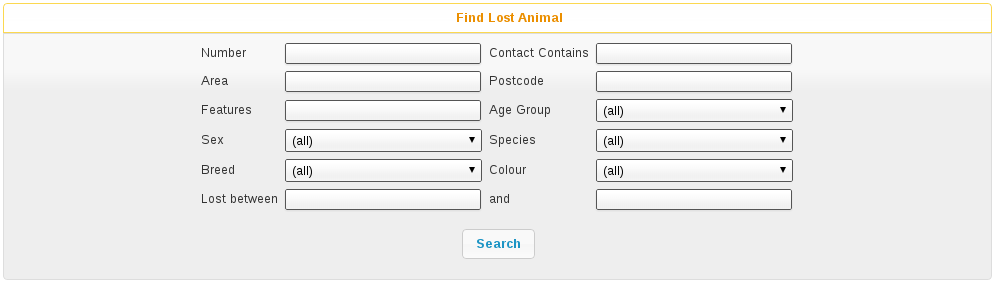
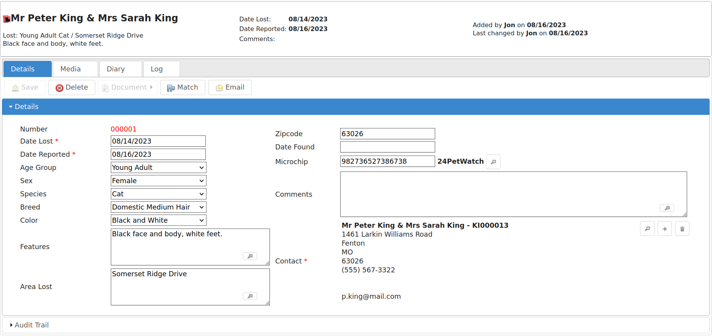

Lost and Found
==============

Animal Shelter Manager also provides a database of lost and found animals. This
is ideal for shelters who maintain lost and found records, where members of the
public phone up to report their animal lost. 

The Find Lost Animal screen works just like the other find screens within
Animal Shelter Manager; you enter criteria at the top, run the search and
results appear at the bottom. You can filter lost animals by a number of
criteria, including species, area in which they were lost and lost between two
dates. 

You can open the Find Lost Animal screen by navigating to 
*ASM->Find Lost Animal*. 

As with other Animal Shelter Manager screens, the Lost Animal screen is divided
into tabs. Lost Animals may also have media attached, as with regular Animal
records.

The screen has its own toolbar, from which you can delete the current record,
save your changes and perform a match computation just for the current lost
animal.

The found animal screens are identical to the lost animal screens. The only
difference is that certain fields have the reverse meaning (ie. Found date
instead of lost date). 

Matching Lost and Found
-----------------------

Once you have your databases of lost and found animals, Animal Shelter Manager
provides facilities to run a match and attempt to work out if any of the
animals reported found could tie up to those reported lost. 

To view the previous results of matching, go to *ASM->Match Lost and Found
Animals*. 

.. note:: Note that because this report can take a while to run if you have a lot of records, ASM will run it overnight as part of its batch processes. It may therefore take upto 24 hours for changes to be reflected.

If you run the Match by pressing the Match button on any lost, found or shelter
animal, the report will be rerun immediately for that animal and you will see
live data. You do not have to wait for this to update, only the main match
report for all animals runs overnight.

Scoring
-------

ASM uses a heuristic scoring algorithm to determine how close the match is
between the lost and found animal (or similar shelter animal, which it will
also check for if the option is set). 

Where the system compares two user defined pieces of text (eg. Distinguishing
features), the system will represent the final score as the number of words
from the lost animal field that appeared in the found animal field, expressed
as a fraction of the total points available for that field. 

For example, suppose I had a lost animal with “white paws, bell” for the
distinguishing features. If there was a found animal with features “white paws,
torn ear and a bell”, that would constitute a 100% match on that particular
field because every single word from the lost animal field appeared in the
found animal field. 

If I had a found animal with “white paws, no collar” for the distinguishing
features, that would constitute a 66% match, because the match was 2/3 words. 

By default, the system scores lost/found matches in this manner (all of these
point values and how many points are required to appear can be changed in
*Settings->Options*

* 5 points - Same Species (note, if the species is not the same, any potential
  match will be abandoned regardless of whether other fields are a match -
  while reporters might not be good at observing the breed, age or sex of an
  animal, they should not have a problem with species!)

* 5 points - Same colour 

* 5 points - Same age group 

* 5 points - Same breed 

* 5 points - proportional match based on words of Area Lost/Found (ie 5 points
  maximum for 100% match of all words in Area Lost being present in Area Found) 

* 5 points - Postcode match 

* 5 points - proportional match based on words of Distinguishing Features 

* 5 points - Same Colour 

* 5 points - Found within 2 weeks of being lost 

It therefore follows that 45 points is a 100% overall match. 

Because some of the found animal fields are not present for animals on the
shelter, the following comparisons are used: 

* Date Brought In is used as Date Found 
* Original Owner address is used for area found 
* Original Owner postcode is used for Postcode area found. 

