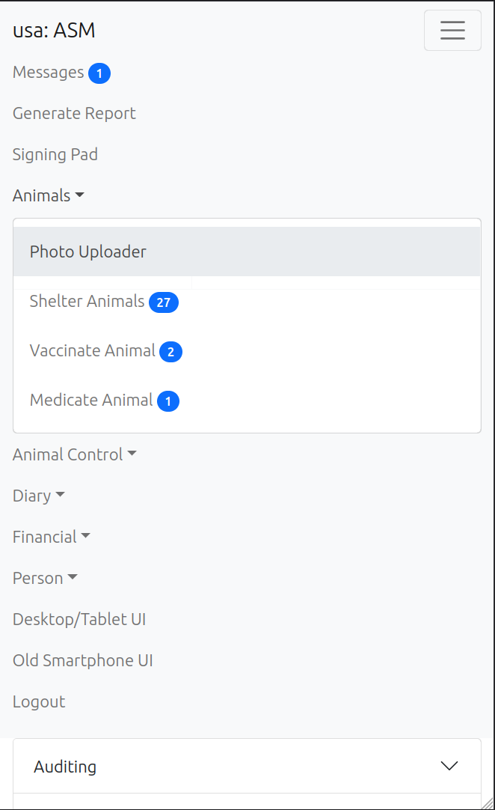
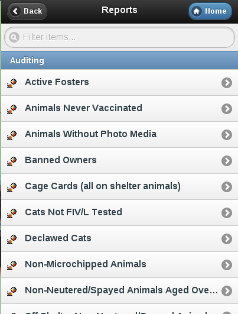

Mobile Interface
================

In addition to the web interface, ASM has a special interface for mobile
devices, such as your iPhone, Blackberry, WebOS or Android handset.

To access the mobile interface, follow the mobile link at the top right of the
login screen.

You can generate any report that doesn't require criteria and view the details
of all the current shelter animals.

.. image:: images/mobile_inventory.png

You can also mark vaccinations and medical treatments given, add logs to
animals, dispatch and respond to animal control incidents, complete diary tasks
and mark homechecks as performed. This last item is very useful for volunteers
going out to homecheck owners prior to adoption.

Mobile App
----------

An app is available in the Google Play, iTunes and Amazon app stores for mobile
devices (search for "sheltermanager").

The app encapsulates a number of interfaces, which you can choose from a dropdown
when logging in. 

* Smartphone Interface: The Mobile interface described above (default)

* Desktop/Tablet Interface: The "full" interface, on your mobile device

* Animal Photo Uploader: An area that links to the gallery or camera of your phone
  and allows you to take or upload existing photos to animal records.

