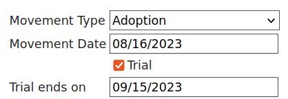
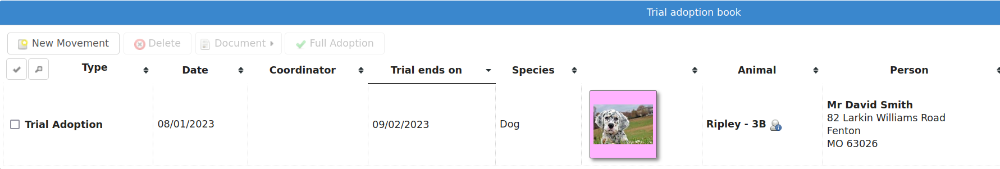
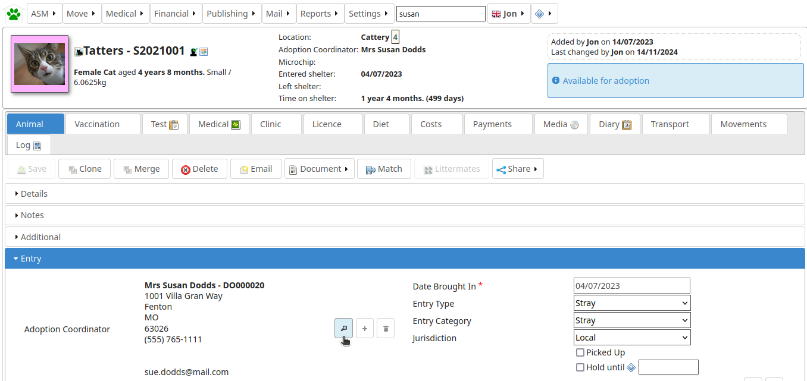
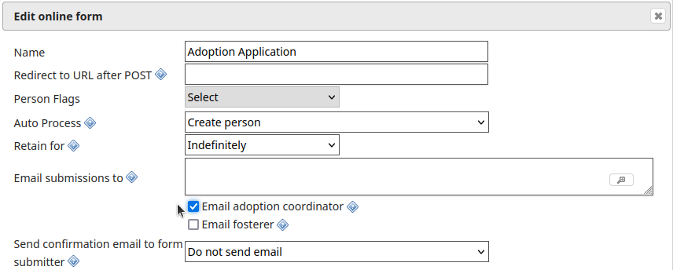

Movements
=========

A large part of the administrative duties you will need to perform with Animal
Shelter Manager revolve around the movement and reservation of animals.

To start with, it is best to explain how the movement system works; each
movement record represents a leaving and returning transaction. You can
therefore only have one (or no) active movement record at a time. ie. No more
than one unreturned movement. This is because the animal cannot leave the
shelter in two different ways without being returned first.

This system allows you to keep track of all the animal's movements over its
lifetime to fosters, adopters, etc.

Any method by which an animal leaves your shelter requires a movement record.
The only exception is death, which is handled through the animal death tab
since it can only occur once.

.. image:: images/move_menu.png

To make this process easier, you can use the Move menu to quickly create
movements for animals. These actions will automatically validate the animal and
person to make sure the movement is appropriate, and if the animal is already
fostered it will be returned first, if it has open reservations/applications
they will be cancelled, etc.

Reservations
------------

A singular exception to this is reservations - since they are not actually a
movement (the animal hasn't gone anywhere) and they represent an adoption
intention.

You can have one or more reservations as well as an open movement. You should
turn the reservation into an adoption movement when the animal is adopted by
the person with the reserve and cancel any other outstanding reservations. If
it detects multiple reservations, ASM will prompt and automatically cancel the
other reservations for you when you turn one into an adoption using the
:menuselection:`Move --> Adopt an animal` screen.

.. note:: ASM calls reservations what some shelters call "adoption applications". You can have as many open applications on an animal as you like with an appropriate status, but only one will ever become the animal's adoption.

In order to help with adoption application tracking, a reservation can be
created that is not yet linked to an animal. The option
:menuselection:`Settings --> Options --> Movements --> Allow reservations to be
created without an animal` needs to be turned on to support this.

Retailer Movements
------------------

ASM has a special kind of movement called a “retailer” movement. This movement
should be used if your shelter sells animals through retailers (pet shops,
etc.). 

To use this, you need to create at least one person on the system with the
“Retailer” flag set. When an animal goes to a retailer, you create a retailer
movement, moving the animal to the retailer (you can use :menuselection:`Move
--> Out --> Move an animal to a retailer`).

Animals at retailers are still classed as on the shelter for reporting
purposes, however you may then use the additional retailer reports to generate
information about retailers (inventories, volumes moved, average time, etc) 

When an owner adopts the animal and the paperwork is received by the shelter,
you should return the animal from the retailer movement, create the real owner
record and adopt the animal to it. If you use :menuselection:`Move --> Out -->
Adopt an animal` and the animal is at a retailer, ASM will take care of this
for you.

Movement records also hold a “from retailer” field, which allows you to
identify a successful adoption to an owner through a particular retailer. As
long as you use the Adopt an animal process, ASM will set this for you.

If you do not want to use retailer functionality, you can turn off the retailer
feature under the :menuselection:`Settings --> Options` screen. 

Trial Adoptions
---------------

If you have enabled the option under :menuselection:`Settings --> Options -->
Movement` for “Our shelter does trial adoptions”, then when you adopt an
animal, either from the movement screens or :menuselection:`Move --> Out -->
Adopt an animal` then a checkbox will appear allowing you to flag that the
adoption is a trial and when the trial ends.

Some shelters commonly call this process "Foster-to-adopt".

Animals who are on a trial adoption will appear under
:menuselection:`Move --> Books --> Trial adoption book`

When the trial ends, an alert will be shown on the home screen, which you can
use as a reminder to contact the owner and either get the animal returned or
make the adoption permanent. There are reports you can also install from the
repository to view active or expired trial adoptions.

You make an adoption permanent by simply unticking the trial box in the
movement record.

Movement Books
--------------

ASM has a set of movement books that can be used for conveniently viewing animals who are currently off the shelter or reserved.

.. image:: images/move_menu.png

They are:

* Reservation book

* Foster book 

* Retailer book 

* Trial adoption book 

* Return an animal from adoption (shows adoptions in the last 30 days)

* Return a transferred animal (shows transfers in the last 30 days)

* Return an animal from another movement (escaped, stolen, released, reclaimed
  animals in the last 30 days).

Conceptually, all the books work in exactly the same way – they show sets of
animal movements off the shelter for different reasons. You can quickly link to
the animal or people records or return the animal from the movement back to the
shelter. To do that, simply open the movement and set a return date (or use the
Return button).

.. image:: images/move_return_animal.png

Adoption Coordinators
----------------------

The adoption coordinator feature allows animals to be assigned to a staff member 
to handle the adoption process. Person records should first be created for these 
members of staff with the "Adoption Coordinator"flag.

.. image:: images/adoption_coordinator_flag.png

Animals can then be assigned an adoption coordinator within the entry section of 
their record.

In shelterview the adoption coordinator view displays animals grouped by their
adoption coordinatoors. 

.. image:: images/adoption_coordinator_shelterview.png

Online form applications which contain an animalname or reserveanimalname field 
can be emailed automatically to the adoption coordinator responsible for the 
selected animal. This option can be enabled by clicking the pencil icon next to
the form, then checking the "Email adoption coordinator" box. For more information
on using online forms, see :ref:`onlineform`     

Adoption coordinatoors can also receive automated email notifications when a 
signing request connected to one of their adoptions has been completed. The 
feature "Notify adoption coordinator when documents are signed" can be enabled 
in the :menuselection:`Settings --> Options --> Documents` screen. 

The reservation book contains a column for the adoption coordinator, clicking 
on the column header will sort the reservations by coordinator to help them 
work through reservations for their animals.  

.. image:: images/adoption_coordinator_reservation.png

The adoption coordinator can be added to document templates using the Coordinator 
wordkeys. For a full list of wordkeys, see :ref:`wordkeys`
