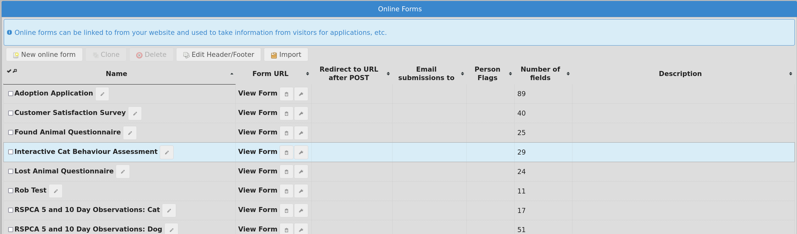

Online Forms
============

ASM allows you to setup online forms that you can use to take information from
members of the public through your website (if your ASM is publically
accessible, or you are using sheltermanager.com). 

This is very useful for handling adoption and waiting list application forms,
questionnaires, taking lost or found animal information from people,
complaints, behavioural assessments, etc. They can be used for any situation
where you'd like to take information from web site visitors.

Forms need a name and a description. The description will be shown to the user
while they are filling out the form. You can also specify a page you'd like to
redirect the user to after they've completed the form.

If you use certain key fields (which the system will autocomplete for you), the
system can create person, lost animal, found animal, animal control incident,
transport or waiting list records directly from the submitted form data. You
can also choose to attach form submissions to animal and people records.

If you set some person flags on your form, any person record created from the
form data will automatically have those flags. In addition to that, the
"checkbox" field type allows you to enter some additional person flags to set
if that checkbox is checked during submission.

Each form has a direct link that is accessed via the service API. Click "View
Form" to follow that link and view the form.  This is the web link you can use
on your website to link people to the form or put in an iframe. 

The first button to the right of "View Form" will copy the link to the
clipboard for you, the second button will view the form in
"development" mode. This is a special mode that bypasses any server side
caching so that changes you make to the form are visible when you reload the
page. When editing forms, it is useful to keep the development link open on
another tab so you can quickly view and test your changes. The development mode
link only works when you are logged in to SM, do not use it on your website.

You may add extra parameters to the form URL if you'd like to set default values
for some of your form fields, by using the format fieldname=value.

The option "Email adoption coordinator" will send a copy of the submission
to the person specified as the adoption coordinator for an animal the form 
is about. The form must have an animalname or reserveanimalname field 
for this to work.

If you set one of the "Send confirmation email to form submitter" options, 
the system will look for a field called "emailaddress" during submission. 
If that field exists and is populated with an email address, a
confirmation email will be sent to that address. The confirmation message
field will form the first part of the body of the email. HTML can be used, but
it must be a complete HTML document that contains an <html> tag. 

.. warning:: sheltermanager.com uses a 30 minute cache on forms, so if you make changes to a form you've recently viewed, you may have to wait 30 minutes for any changes you make to appear. Use the development mode button to see your changes immediately.

If you declare a javascript function in your form's header or footer named
asm3_onlineform_submit, it will be called when form validation is successful
and just before the form is submitted. You can use this if you want to grab the
form values and send them somewhere else or transform the values before it is
submitted to ASM::

   function asm3_onlineform_submit() {
      alert("form is about to be submitted");
   }

Editing Form Fields
-------------------

Clicking on the form's name will allow you to edit the individual fields of
information the report will take.

.. image:: images/onlineform_fields.png

The dialog will autocomplete the known fields that ASM can look for when
creating records from form submissions. For details, see :ref:`onlineformfields`

To create any record, you will need at least a lastname or surname field. Lost
animal records need an arealost and description, found animal records need an
areafound and description, waiting list records need a description.

The "lookup", "radio" or "multi-lookup" field types require a list of
values. You should separate these with the pipe character. Eg:
Option 1|Option 2|Option 3

The "signature" field type allows the person completing the form to sign
electronically with a touchscreen.

A "raw markup" field type allows you to insert your own HTML sections within
the form. This is useful for adding contract clauses, headings, or any sort
of extra formatting. 

The "GDPR contact" field type allows for a multiple lookup of GDPR
communication choices to be made for resulting person records.

When forms are submitted through the website they come through to the “View
Incoming Forms” screen, where the values can be inspected by clicking the name
of the form submission. The screen shows a preview of the incoming data and the
IP address that submitted it.

If a field called "emailaddress" is supplied as part of the form submission,
the complete submission will be emailed automatically to the person who
completed it for their records. 

Similarly, if a field called "emailsubmissionto" is supplied, containing one or
more comma separated email addresses, the submission will also be emailed to
these extra addresses. This can be useful to have form values trigger hidden
values to send submissions to other addresses.

If you have a field where the name prefix is "additionalX", the system will
look for an additional field called X and store the submission value in it
when creating a person record. It will only work for new person records created
from the form submission and not if the form updates an existing person record
to prevent overwriting data.

Show If syntax
^^^^^^^^^^^^^^

It is possible to have the system only display some of your form fields based
on a condition being met. There are many situations where you may want to do
this to remove unnecessary fields based on previous answers (for example, remove
questions about the landlord if the person is not renting, or questions about
dogs if they are surrendering a cat, etc).

Edit the form field that you want to show or hide based on a condition, and
enter the condition in the "Show If" box.

The syntax for show if is::

   fieldname=X

to only show if the form field with fieldname currently has the value X.

You can also use ! instead of = to only show if the field does NOT have
the value and < or > to use lesser than or greater than comparisons
with a fixed value. Eg::

   fieldname!notthis
   fieldname>0
   fieldname<20

If a value is not supplied, the system will compare against an empty
string, so you can test that a field is or isn't empty::

   fieldname=
   fieldname!

If fieldname is a checkbox, you can test for the special keyword "on" to
indicate you want the box checked (or "off" for unchecked)::

   mycheck=on

If you want to reference a checkbox that is part of a checkbox group, you
can reference it by the name of the group and item number, starting with 0
for the first item::

   checkboxgroup0=on
   checkboxgroup1=off

Multiple conditions can be specified. They can be either ANDed together or ORed
together, but NOT both at the same time.

In an AND expression, all conditions have to be true in order for the field to
be displayed.  Separate your AND conditions with an ampersand & ::

   mycheck=on & fieldname=X

In an OR expression, only one of the conditions has to be true in order for the
field to be displayed. Separate your OR conditions with a pipe | ::

   hascats=Yes | hasdogs=Yes

.. note:: Only check boxes, radio buttons, text and lookup fields can be used with Show If

Incoming Forms
--------------

.. image:: images/onlineform_incoming.png

Selecting a form allows you to intelligently create or attach records from the
data, or explicitly attach the form to existing records.

* Attach Person: Prompts for a single person record and attaches a copy of the
  form to them as media.

* Attach Animal: Prompts for a single animal record and attaches a copy of the
  form to them as media. If the animal is bonded, attaches to the bonded
  animals too.

* Attach Animal (via animalname): Attaches the form to a single animal record
  based on the animalname field in the form itself. If the animal is bonded,
  attaches to the bonded animals too.

* Create Animal: Searches for an animal record matching the code field on the 
  form if present. If a match is found, the form is attached to that animal,
  otherwise a new animal record is created. While you can use the Species
  and Breed field types with the breed1/breed2/color fields, you can also
  use your own lookup lists containing subsets of these items for users
  to choose from. When creating animals, the animalname and one of dateofbirth
  or age are mandatory.

* Create Person: Searches for a person record matching either the email address
  if present, or the firstname, lastname and address fields on the form. If a
  match is found, the form is attached to that person. If no match is found, a
  new person record is created. If a “reserveanimalname” field was found on the
  form as well, a reservation to the matching animal is created to the person
  (these can be all viewed under :menuselection:`Move --> Reservation Book`).
  If the animal was bonded, reservations will be created for the bonded
  animals too.

* Create Lost Animal: Runs through the same steps as Person so needs enough
  information to create/find a person as well. “description” and “arealost”
  fields are the minimum required to create the lost animal record.

* Create Found Animal: Runs through the same steps as Person so needs enough
  information to create/find a person as well. “description” and “areafound”
  fields are the minimum required to create the found animal record.

* Create Incident: Runs through the same steps as Person so needs enough
  information to create/find a person as well. That person becomes the
  “caller”.  “callnotes” and “dispatchaddress” fields are the minimum required
  to create the incident record.

* Create Transport: Runs through the same steps as Animal, so needs
  an "animalname" field to figure out who to attach the transport to.

* Create Waiting List: Runs through the same steps as Person so needs enough
  information to create/find a person as well. A “description” field is the
  minimum required to create the waiting list record.

When you create a new record or attach the form, the whole form will be
included in the media tab of any created records (animal, incident, person AND
lost/found animal or waiting list). The screen will put a link in the Link
column to give you a clickable link to the newly created record as well so you
can view it. The system will also show a little warning icon at the side of this
link if that record already existed and was updated instead of newly created.

Incoming forms that have been attached to a record will be automatically
deleted when you leave the screen. The system will also remove incoming forms
older than 4 weeks by default. Both of these options are configurable
under the Online Forms tab of :menuselection:`Settings --> Options`

Application Forms
-----------------

ASM calls an application a "reservation". If your form has a field named
"reserveanimalname" of type "Adoptable Animal", then using "Create Person" on
an incoming form submission will create a reservation for the new person to
that animal.

If you want to allow a person to apply for more than one animal, then you
can add fields called reserveanimalname2, reserveanimalname3, etc.

The reservation will link the new person and the animal record. That link can be
viewed under the movement tab of the person or animal, and you can view all
current applications under :menuselection:`Move --> Reservation Book`.

Reservations can have a status (eg: New, Pending home visit, Denied, etc). 

You can configure your own statuses under :menuselection:`Settings --> Lookup
Data --> Reservation Statuses`

Since the system default is to make animals who have a reservation not
available for adoption, you may want to change this by setting
:menuselection:`Publishing --> Set Publishing Options --> Animal Selection -->
Include Reserved` to YES.

Importing
---------

ASM also allows importing of online forms from files. 

Form files can be in a structured JSON format that ASM recognises, eg::

    {
        "name": "Adoption Application",
        "description": "",
        "header": "",
        "footer": ""
        "fields": [
            { "index": 1, "lookups": "", "mandatory": "true", "name": "reserveanimalname",
              "tooltip": "", "label": "Animal you are interested in", "type": "ADOPTABLEANIMAL" },
            { "index": 2, "lookups": "", "mandatory": true, "name": "firstname",
              "tooltip": "", "label": "Applicant's First Name", "type": "TEXT" },
            { "index": 3, "lookups": "", "mandatory": true, "name": "lastname",
              "tooltip": "", "label": "Applicant's Last Name", "type": "TEXT" }
        ]
    }

Files can also be HTML, where the import mechanism will extract all of the
input, select and textarea elements. It will use the name attribute to set the
field name and label. The HTML page title will be used as the form title.

HTML import is only basic, but can be used to grab the existing fields of a
form you already have ready for editing, eg::

    <!DOCTYPE html>
    <html>
    <head>
    <title>My Adoption Form</title>
    </head>
    <body>
    <form action="handler" method="post">
        
<input type="text" name="firstname"> First Name

        
<input type="text" name="lastname"> Last Name

    </form>
    </body>
    </html>

