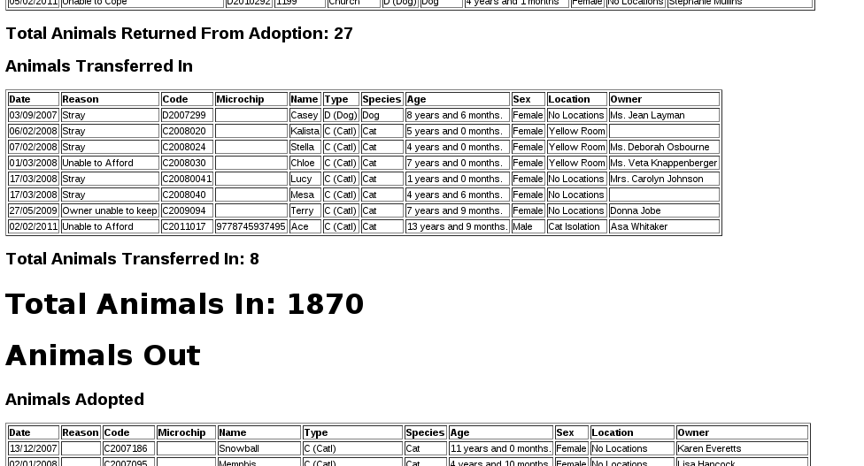
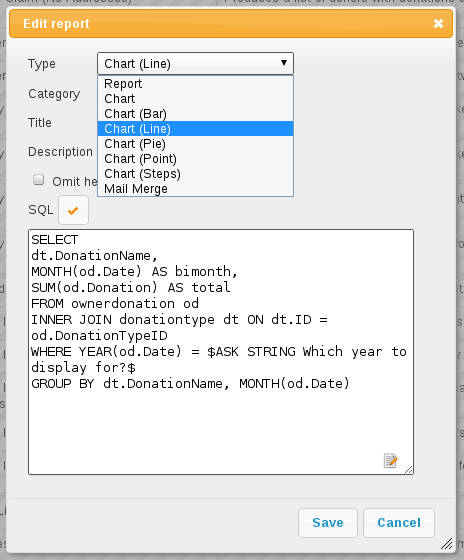

Reports
=======

Animal Shelter Manager offers some highly detailed reporting facilities that
fall broadly into the following categories.

All reports are accessed from the Reports top level-menu. By default, ASM does
not install with any reports. You must install them from
:menuselection:`Settings --> Reports --> Browse sheltermanager.com` – this
requires your ASM server to have access to the internet. There's an “Install
Recommended” button you can use to choose the default set to install.

Some of the standard, most useful reports you should install are:

* Long Term Animals: Produces a detailed report of animals who have been in the
  shelter longer than three months. 

* Shelter Inventory: Outputs total figures for every animal on the shelter,
  broken down by species and their location within the shelter. 

* Detailed Shelter Inventory: Identical to the Shelter Inventory, except it
  provides details of the individual animals as well.

* In/Out: Shows a detailed listing of all the animals that entered or left the
  shelter between two dates. 

* In/Out Summary: Identical to the In/Out report, but only shows the bottom
  line totals without information about the actual animals. 

* Animals Returned Within Six Months: Produces a detailed report of animals who
  were returned to the shelter within six months of adoption (allows you to
  select a date range to filter the animals down to when they were adopted). 

* Animals Returned After Six Months: Functionally the same as Animals Returned
  Within Six Months, except it only shows animals who were returned after six
  months of adoption. 

* Returned Animals Report: Produces a detailed report of animals (complete with
  full adoption histories) who have been returned between the two dates
  specified. 

* Animal Death Reasons: Produces a report listing all the reasons for which
  animals have died on the shelter. 

* Monthly Donations: Charts donations taken for animals brought into the
  shelter and adopted to new owners over the selected year (as well as
  arbitrary donations). 

* Monthly Donations By Species: Same as monthly donations, but only for a
  particular species and does not include arbitrary donations. 

* Monthly Adoptions By Species: Charts the number of adoptions of a particular
  species over a selected year. 

* Monthly Adoptions By Locations: Charts the number of adoptions of a
  particular species over the different shelter locations over a selected year. 

.. image:: images/reports_entryreasons.png

* Animal Entry Reasons: Charts the different reasons for animals entering the
  shelter over the selected year. 

* Animal Return Reasons: Charts the different reasons for animals being
  returned to the shelter over the selected year. 

Customising Reports
-------------------

In addition to the stock reports provided by the sheltermanager.com repository,
it is possible to create your own, using a simple language called “SQL” (short
for “Structured Query Language”). SQL is a language for retrieving and
formatting information - underneath, ASM uses this language to talk to its
database (Either MySQL or PostgreSQL - as the names imply, they all talk SQL).

The reports editing screen is located under the Settings menu, any reports you
create will integrate into the Reports menu. You can also use this screen to
rearrange and rename existing reports and charts in the system. You can also
assign “view roles” to reports. If you assign one or more view roles, then only
users in those roles will be able to run the report and see its output.

In addition to just creating queries, you can then format how the data is
transformed and displayed to you in the format of a report. Again, this is done
through the use of another language - HTML (HyperText Markup Language). This is
the same language used for creating web pages on the internet.

The report editor has a button to automatically run your query and generate the
HTML for you in a simple table format. It is worthwhile running this and then
modifying the HTML afterwards. 

The editor will highlight the syntax of both languages for you, and if you
press :kbd:`F11`, will allow you to edit in full screen mode. For SQL, you can use
:kbd:`CTRL+SPACE` to get context-sensitive help with ASM's tables and columns.

For some excellent beginner tutorials on both SQL and HTML, see
www.w3schools.com 

SQL Keys
^^^^^^^^

What happens if you want to create a report that needs to request specific
information from the user before running - eg: To filter between two dates, or
only show animals of a particular species, etc?

ASM offers SQL preprocessor instructions to allow you to substitute system
information, or information requested from the user at report generation time. 

* $USER$ - Substitutes the current user's name. 

* $LOCATIONFILTER$ - Substitutes the current user's location filter (a comma
  separated string of internal location IDs) or a list of all internal location
  IDs if the user does not have a location filter.

* $SITE$ - Substitutes the current user's site ID (multi-site only).

* $CURRENT_DATE$ - Substitutes today's date in an appropriate string SQL format
  for the current database. This saves you having to use NOW() or
  CURRENT_DATE() or various other SQL functions specific to one database.
  Note that the user's timezone is applied to the date/time.

* $CURRENT_DATE_TIME$ - Substitutes the date and time now in an appropriate
  string SQL format for the current datbase. Note that the user's timezone
  is applied to the date/time.

* $CURRENT_DATE-X$ - The same as CURRENT_DATE, but subtracts X days.

* $CURRENT_DATE+X$ - The same as CURRENT_DATE, but adds X days.

* $CURRENT_DATE_FDM$ - Returns the first day of the current month.

* $CURRENT_DATE_LDM$ - Returns the last day of the current month.

* $CURRENT_DATE_FDY$ - Returns the first day of the current year.

* $CURRENT_DATE_LDY$ - Returns the last day of the current year.

* $PARENTKEY$ - Substitutes the field value named in the report calling this
  subreport. For example, a report could pass an Animal ID as the parent key to
  a subreport for filtering data correctly. When you use this key in your
  report SQL, ASM assumes that this report is a subreport and will not display
  it on the menu. 

* $PARENTARGX$ - Substitutes argument X passed to the subreport. For example, a
  subreport generated with {SUBREPORT.Myreport.ID.ShelterCode.AnimalName} could
  access the parent AnimalName field with $PARENTARG3$. When you use this key
  in your report SQL, ASM assumes that this report is a subreport and will not
  display it on the menu. 

* AS money[fieldname] – If you alias an output field so that it has the prefix
  “money” as its name, the report engine will make sure it's formatted as a
  currency and assume that its value is a whole integer money amount (where 1
  is 1 cent/pence/etc).

* AS [fieldname]n2br - If you alias an output field so that it has a suffix
  of "n2br" as its name, the report engine will translate line breaks in the
  column data to HTML   tags so that they show on the report.

ASK
^^^

Ask is quite a detailed key, which requests information from the user at
generation time. The basic syntax is this::

    $ASK [TYPE] [Message]$

.. note:: If you are substituting any kind of string value (ASK DATE or ASK STRING), you must wrap the ASK key inside string delimiters (the apostrophe ') otherwise you will get SQL errors. 

The types are outlined below: 

* $ASK DATE message$ - requests a date from the user. A popup is displayed
  containing the message and the user is given an ASM date control to use to
  select the date. The value substituted is the date selected by the user in
  SQL string format appropriate for the database you are using.

* $ASK ANIMAL$ - requests a shelter animal. The value substituted is the animal ID. 

* $ASK FSANIMAL$ - requests a foster animal. The value substituted is the
  animal ID. 

* $ASK ALLANIMAL$ - requests any animal. The value substituted is the animal ID. 

* $ASK ANIMALS$ - requests one or more shelter animals. The value substituted
  is a comma separated list of animal IDs, useful for putting in an IN clause
  (eg: AnimalID IN ($ASK ANIMALS$))

* $ASK ANIMALFLAG$ - requests an animal flag.

* $ASK PERSON$ - requests an person. The value substituted is the person ID. 

* $ASK PERSONFLAG$ - requests a person flag.

* $ASK LITTER$ - requests a litter identifier. A popup displays a list of the
  recent, active litters on the system. The value returned is the litter ID as
  a string. 

* $ASK SPECIES$ - requests a species from the user. A popup is displayed
  containing a dropdown of all species on the system.

* $ASK LOCATION$ - requests an internal location from the user in the same
  manner as $ASK SPECIES$ 

* $ASK VOUCHER$ - requests a voucher from the user in the same manner as $ASK
  SPECIES$ 

* $ASK DIET$ - requests a diet from the user in the same manner as $ASK
  SPECIES$ 

* $ASK PAYMENTMETHOD$ - requests a payment method. 

* $ASK PAYMENTTYPE$ - requests a payment/donation type from the user in the
  same manner as $ASK SPECIES$

* $ASK LOGTYPE$ - requests a log type from the user in the same manner as $ASK
  SPECIES$

* $ASK TYPE$ - requests an animal type from the user in the same manner as $ASK
  SPECIES$ 

* $ASK LOOKUP message|value1,value2,value3$ - requests one from a selection of 
  fixed lookup values from the user.

* $ASK NUMBER message$ - requests a numeric value from the user. A box is
  popped up containing the message and the user is given a standard text box to
  enter the number in. They will not be allowed to continue until a valid
  number is entered. The value returned is the number. 

* $ASK STRING message$ - requests a string value from the user (eg: Name,
  Address, etc.). A box is popped up containing the message and the user is
  given a text box to enter the string in. The value substituted is the string. 

.. note:: ANIMAL, FSANIMAL and ALLANIMAL are identical in the desktop interface. They produce different choices in the mobile interface.

VAR
^^^

VAR works just like ASK, the only difference is that instead of substituting
the value into the SQL, it stores it to a variable name. You can then
substitute the variable multiple times in your SQL::

    $VAR <varname> [TYPE] [Message]$

The VAR tag should appear in your SQL before you reference the variable
created. The variable is substituted with $@varname$ 

This example shows a list of animals of a selected species brought in after the
given date. The species and broughtinafter variables could be reused as many
times as we like::

    $VAR species SPECIES$
    $VAR broughtinafter DATE The date the animals were brought in after$
    SELECT AnimalName, DateBroughtIn FROM animal 
    WHERE SpeciesID=$@species$ AND DateBroughtIn >= '$@broughtinafter$'

CONST
^^^^^

CONST allows you to declare a constant value for later use in your query::

    $CONST name=value$

A constant must have a name and it can be accessed with $name$ (it does not
require the @ prefix like variables).

This example shows a list of all adopted animals and assigns the adoption
movement type 1 to a constant::

    $CONST MOVEADOPT=1$

    SELECT AnimalName FROM animal WHERE ActiveMovementType = $MOVEADOPT$

Report Grouping and Calculation
^^^^^^^^^^^^^^^^^^^^^^^^^^^^^^^

In addition, ASM allows you to do a number of transformations to the output
HTML. You define a number of “blocks” to your reports. Anyone who has used a
reporting tool (eg: Microsoft Access or Crystal) will recognise these. 

* $$HEADER ... HEADER$$ - The topmost section of the report should be entered
  here.
 
* $$FOOTER ... FOOTER$$ - The bottom most section of the report should be
  entered here. 

* $$BODY ... BODY$$ - The main section of your report where the detail goes. 

* $$GROUP_<field> .. GROUP$$ - Optional grouping level. If you want to group by
  a particular field in the formatted output, you should add a group block.
  Within the group block you must also define a $$HEAD and $$FOOT section. 

* $$NODATA … NODATA$$$ - A special block to output if the report query returns
  no data.

* $$HTMLHEADER … HTMLHEADER$$$ - Override the report template HTML header and
  supply a new one instead.

* $$HTMLFOOTER … HTMLFOOTER$$$ - Override the report template HTML footer and
  supply a new one instead.

For example, to group on the OwnerName field::

    $$GROUP_OwnerName
    $$HEAD
    <h2>$OwnerName</h2>
    $$FOOT
    
Number of owners with name '$OwnerName': {COUNT.OwnerName}

    GROUP$$

ASM also offers a number of calculation instructions you may use in group
$$FOOT blocks and the main $$FOOTER block. These are: 

* {SUM.<field>[.round]} - Calculates the total of a given field for a group.
  Optionally, you can specify the number of decimal places to round to. 

* {COUNT.<field>[.distinct]} - Returns the number of records in the group.
  If the optional distinct parameter is set, returns the number of unique
  values of <field> within the group.

* {AVG.<field>[.round]} - Calculates the average of a group, based on the total
  of the field and the number of records. Optionally, you can specify the
  number of decimal places to round to. 

* {MIN.<field>} - Shows the smallest value for a given field in a group 

* {MAX.<field>} - Shows the largest value for a given field in a group 

* {FIRST.<field>} - Returns the first value for a given field in a group 

* {IMAGE.<animalid>[.seq]} – (also valid in $$BODY) Returns a URL to the
  preferred image for the given animal ID. Animal IDs can be a $field from the
  selected data. If the optional sequence number is given, then a link to image
  seq (where seq is a 1-based count) for the animal is output instead. If seq
  is invalid, or the animal doesn't have a preferred image the default system
  nopic.jpg file is used instead.

* {CHIPMANUFACTURER.<chipno>} - (also valid in $$BODY) Returns the name of
  the microchip manufacturer of the given chip number.

* {QR.<animalid>[.size]} – (also valid in $$BODY) Returns a URL to the google
  charting api to generate a QR code with a link to this animal's record for
  mobile devices. If size is not set, then 150x150 is used. Eg:
  {QR.$ID.200x200}

* {LAST.<field>} - Returns the last value for a given field in a group 

* {PCT.<field>.<value>[.round]} - Returns the percentage of rows in the group
  where field <field> matches value <value>. Optionally, you can specify a
  number of decimal places to round to. Eg: {PCT.Sex.1.2} Would show the
  percentage of male animals in the group, rounded to 2 decimal places. 

* {SQL.<sql command>} - executes the SQL and outputs the value of the first
  field. Eg: {SQL.SELECT COUNT(*) FROM animal}. This tag is also available in
  the $$BODY block and can be used in conjunction with the field tags to
  produce a subquery. Eg: Suppose you wanted to show the number of movements
  attached to a particular animal without doing a group query with an inner
  join to adoption. You could just use {SQL.SELECT COUNT(*) FROM adoption WHERE
  AnimalID = $ID} 

* {SUBREPORT.<title>.<parentkey>[.<parentarg>]} - executes the custom report
  with [title] and with the [parentkey] being the name of a field from the
  current report data to pass down to the subreport. The report output is
  embedded in the current report. You can use the $PARENTKEY$ field in the
  subreport to access this value for filtering your data. 

  .. note:: You can nest reports to an unlimited depth. You can pass an unlimited number of fields to a subreport, accessible as $PARENTARGX$ where X is the number of the argument you want to access in the subreport query.

Here is an example report to show all animals currently on the shelter, with
their picture, grouped by their internal location and giving totals for each::

    SELECT animal.ID, animal.AnimalName, animal.ShelterCode, internalLocation.LocationName
    FROM animal
    INNER JOIN internallocation ON 
    animal.ShelterLocation = internallocation.ID
    WHERE animal.Archived = 0
    ORDER BY internalLocation.LocationName

    $$HEADER
    HEADER$$

    $$GROUP_LocationName
    $$HEAD
    <h2>$LocationName</h2>
    <table>
    <tr>
    <th>Name</th>
    <th>Code</th>
    <th>Picture</th>
    </tr>
    $$FOOT
    </table>
    
<b>Total at $LocationName: {COUNT.AnimalName}</b>

    GROUP$$

    $$BODY
    <tr>
    <td>$AnimalName</td>
    <td>$ShelterCode</td>
    <td></td>
    </tr>
    BODY$$

    $$FOOTER
    FOOTER$$

Charts
------

Charts work just like the reports. The difference is that instead of generating HTML, you just  choose a chart type from the type dropdown.

ASM will dissect the results of the query in the following way to generate a graph, depending on whether your query returns two or three columns.

Two column variant
^^^^^^^^^^^^^^^^^^

1. Each row in your result data becomes a point on the X axis 

2. The first column in each row is assumed to contain the name used for the
   label on the X axis. Only string data should be used for the first column. 

3. Each subsequent column is assumed to be a piece of data at that point on the
   X axis (and thus gives the Y axis its scale). Only numeric data can appear
   in columns after the first one. 

4. The fieldname of each column after the label column is used to denote the
   data on the legend. 

For example, this SQL will produce a graph that shows the amount of donations
from animal movements each year. Following our scheme, the Year column being
first is the X axis label, TotalAmount is the first datapoint for that item on
the X axis::

     SELECT YEAR(DateReceived) AS Year, 
     SUM(ownerdonation.Donation) AS TotalAmount 
     FROM ownerdonation
     WHERE MovementID > 0
     GROUP BY YEAR(DateReceived) 
     ORDER BY Year
    
Would produce data that might look something like: 

==== ===========
Year TotalAmount
==== ===========
2004 59840
2005 61893
2006 51039
2007 55984
==== ===========

.. note:: Graphs use a relative scale, interpreted from the data. If all of your column data is the same value, then the graph will not display because it has no variance. 

Three column variant
^^^^^^^^^^^^^^^^^^^^

1. Each row in your result data becomes a point on the X axis 

2. The first column in each row is assumed to contain the name used for a
   series.

3. The second column in each row contains the X axis label.

4. The third column contains the value for the Y axis and must be numeric.

For example, this SQL produces a graph that shows the number of donations made
for over a year by internal location. Each location becomes a series with a set
of data points for each month of the year::

    SELECT i.LocationName, 
    MONTH(ad.MovementDate) AS bimonth,
    COUNT(ad.Donation) AS total
    FROM adoption ad
    INNER JOIN animal a ON ad.AnimalID = a.ID
    INNER JOIN internallocation i ON i.ID = a.ShelterLocation
    WHERE YEAR(ad.MovementDate) = $ASK STRING Which year to display for?$
    AND ad.MovementType = 1
    GROUP BY i.LocationName, MONTH(ad.MovementDate)

Maps
----

Maps are just like the reports. The difference is that instead of generating
HTML, they will output map markers from a LatLong field.

ASM expects map queries to return a resultset containing at least two columns. The first
is the LatLong marker for the map, and the second is the text to display in the
popup when the marker is clicked.

For example, this SQL will produce a map that shows the location of every
person on file, with their address when the marker is clicked::

    SELECT LatLong, OwnerAddress FROM owner

If there are more than two columns in the query results, the report engine will
concatenate together the values of each subsequent column. 

This SQL will produce a map with every person on file, but includes a clickable
link to the person record when the marker is clicked::

    SELECT LatLong,
        '<a target="blank" href="person?id=', ID, '">',
        OwnerName,
        '</a>'
    FROM owner ORDER BY ownername

Automatic updating of repository reports
----------------------------------------

When you install a report from the repository, some reports have a revision 
number. This number will be shown in the list on the reports editing screen
next to the report's title.

If we update the repository with a newer version of that report, it will get a new
revision number. Each time you visit the home page, the system will automatically 
check for newer versions of reports. If it finds any, it will update the SQL and HTML 
of your copy of the report to the latest version. It will only change the SQL/HTML
and update any subreports, it will not change the description if you updated it.

If you change the title or category on your copy of a report, this will prevent 
it being updated by the auto updater. You can use this to lock a report to a 
particular version.

