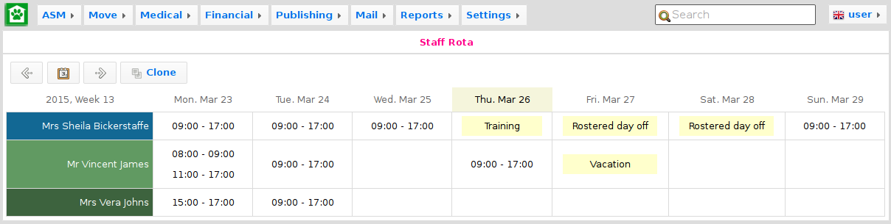
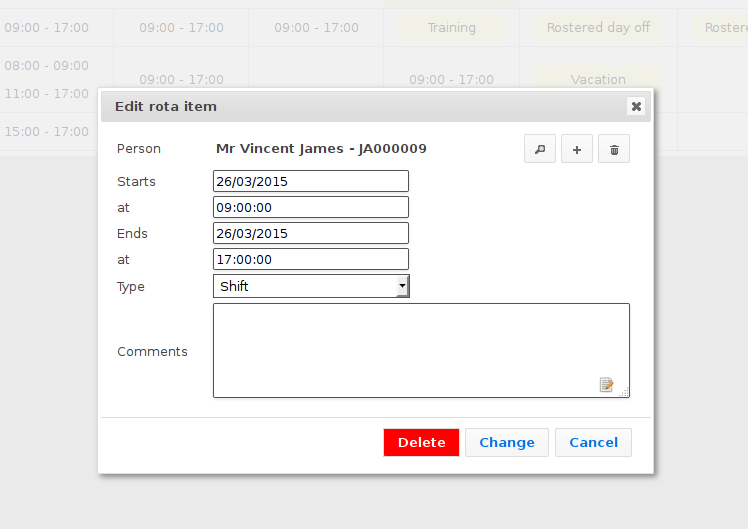

Rota
====

ASM allows you to create and schedule staff rotas. A rota combines shifts and
time off details for all staff and volunteers. You can find the rota screen at
:menuselection:`ASM --> Person --> Staff rota`.

The rota screen shows all staff members down the left side, followed by all
volunteers. Hovering over a person's name will indicate their status as a staff
member or volunteer, with staff members shown in blue and volunteers in green.

Across the top, the rota shows each day of the week with today highlighted if
the rota is showing the current week.

New rota entries can be created by clicking in the empty cells for a given day
and person:

.. image:: images/staff_rota_blank.png

The defaults will be filled in for you and new records default to "shift". You
can set the default shift times under :menuselection:`Settings --> Options -->
Defaults`.

If you click on an item in the rota, you can edit it directly as well as
deleting it from that dialog.

Items that span multiple days will appear on each day they apply to. Generally,
it is time off variants rather than shifts that span multiple days.

The staff rota screen also gives you the facility to clone the current week's
rota to a future week. This is the expected mechanism for propogating the rota
each week.
