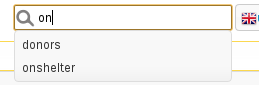

Search
======

The search box allows you to search the whole of the ASM database. If you just
enter a search term and press enter, all types of record will be searched.

Previous searches will be remembered and ASM will try to suggest searches as
you type.  You can prefix your term with a code to tell the search to only
search a certain type of record.

* a:term will only search animals
* ac:term will only search animal control incidents
* p:term will only search people
* la:term and fa:term will search lost and found animals
* li:num will search issued license numbers
* lo:term will search logs for all records
* vo:code will search issued vouchers
* wl:term will search waiting list entries.

In addition to prefixes, you can add an extra clause to control sorting.

* sort:az will sort alphabetically a to z on name
* sort:za will sort alphabetically z to a on name
* sort:mr will sort by most recently changed
* sort:lr will sort by least recently changed
* sort:as will sort alphabetically a to z on species (only applies to animal
  records – makes more sense in combination with animal search keywords like
  “forpublish” or “onshelter”)
* sort:sa will sort alphabetically z to a on species
* sort:rel will sort by most recently changed, but more relevant items will be
  moved to the top. For example if the search term exactly matches an animal's
  name or owner's surname, they will be considered more relevant and appear
  first.

There are a number of special keyword terms you can use:

* onshelter (or os) – all on shelter animals
* longterm - all animals who have been on shelter longer than 6 months
* notforadoption – all animals flagged not for adoption
* notmicrochipped - all animals who are not microchipped
* hold – all animals currently being held in case of reclaim
* holdtoday - all animals with a hold that ends today
* quarantine – all animals currently quarantined
* deceased – animals deceased in the last 30 days
* forpublish – all animals available for adoption and matching publishing
  options
* people – all people
* fosterers, volunteers, shelters, aco, banned, staff, retailers, vets, homechecked,
  homecheckers, drivers, members and donors – all people with those flags set
* reservenohomecheck - active reservations where a homecheck has not been done
* activelost – all lost animals who have not been found yet
* activefound – all found animals who have not been returned

Eg:

    a:Cat sort:az   - find all cats, sort by name
    a:Jack          - all animals called Jack

.. image:: images/searchresults.png

