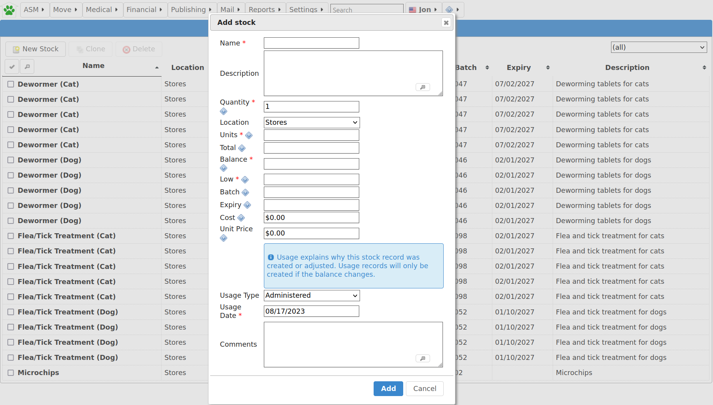
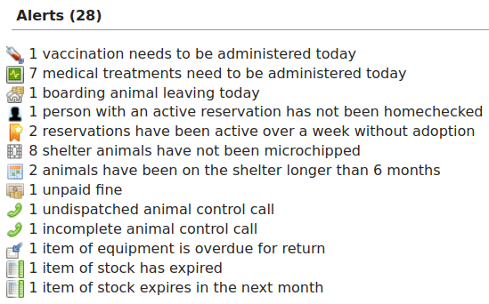

Stock Control
=============

Animal Shelter Manager includes a stock control system for managing stores of
drugs, food and other items.

Before using the module, you should set up locations for your stock under
:menuselection:`Settings --> Lookup Data --> Stock Locations`. Locations help
subdivide your stock to assist with the stock taking process. A useful
convention (similar to account codes) is to use a separator for child locations
so they appear together in lists. For example, you could create locations
called "Office", "Office::Shelves" and "Office::Desk", which would all appear
together in the list of available locations and be able to hold their own list
of stock.  

To view and add to current stock levels, go to :menuselection:`Financial -->
Stock levels`

.. image:: images/stocklevels.png

Listed are all stocks for all locations on the system. You can use the dropdown
on the right-hand side to only show stock in a particular location. Stocks will
be highlighted in red if their expiry date has passed (as well as an alert).
Similarly, stocks will appear faded out if their balance has dropped to zero
and there are no items left.

If you are familiar with the stock card approach to drug management, this is an
electronic version of that system. With stock cards, each container gets a card
(a stock record in ASM) that tracks how many items started and remain in that
container, along with a note each time the stock was used.

Adding new stock
----------------

Use the "New Stock" button to add a new stocked item. Each stocked item is
assumed to be a container of  "total" items as described by the "units" field.
The "balance" field is the amount remaining in the container and will decrement
as the stock is used. You can also set an expiry date and batch number for
drugs and perishable goods. In addition, if you set a "quantity", this is the
number of records to create if you have multiples of the same item.

So, for example, you have 5 boxes of metacam chewable tabs, each box contains
10 tabs::

    Name: Metacam 1mg chewable tablet
    Description: Box of 10 1mg chewable meloxicam tablets
    Quantity: 5
    Location: Stores
    Units: 1mg chewable tablet
    Total: 10
    Balance: 10

Every time the level of a stock changes (the balance) or a stock is newly
created, a "usage" record for that item is also created that explains why that
stock has changed with a stock usage type/category. You can also add some
comments.

The system will remember items you have previously entered and the name and
unit fields will autocomplete suggested values for you as you type. 

Using stock (manually)
----------------------

To use stock, you can simply open up the stock record by clicking its name in
the list of current stocked items and adjusting the balance. When you change
the balance of an existing record, the usage fields will appear to prompt you
to create a usage record to explain why this stock record has changed.

If the stock has expired and is to be thrown away, set the balance to zero and
use the "wastage" usage type so that reports can calculate how much stock has
been wasted. When loading stock screens and items for selection, any stocked
items with zero balances will be hidden from view.

Using stock (medical, tests and vaccinations)
---------------------------------------------

As a shortcut, when you are performing tests or administering vaccinations and
medical items through the tabs on the animal record or via
:menuselection:`Medical --> Test Book`, :menuselection:`Medical --> Vaccination
Book` or :menuselection:`Medical --> Medical Book` the system will prompt you
to deduct stocks for the test/vaccination/treatment.

When you hit the "Give" or "Perform" button on any of those screens, a dialog
will appear to prompt you for the date the test was performed or
treatment/vaccination administered and usage information to decrement an
appropriate stocked item.

.. image:: images/stock_usage.png

However many treatments/vaccinations/tests were selected to be marked given or
performed, only one stock deduction will be made so you should make sure the
deduction covers all the selected items.

Stock alerts
------------

The system will produce alerts on the front screen when you have stocked items
that have either expired or are due to expire in the next month. 

Products
--------

ASM allows you to create product records for all of the items that you buy
and manage as stock. Think of them as templates that can be used to quickly
create stock levels.

In addition to this, the products screen will show you the total that you
have in all stock levels for each product as well as giving you a convenient
method to move or consume stock levels based on the product.

The "Usage" button allows you to view all usage records for stock levels
connected to the product.

.. image:: images/stock_products.png