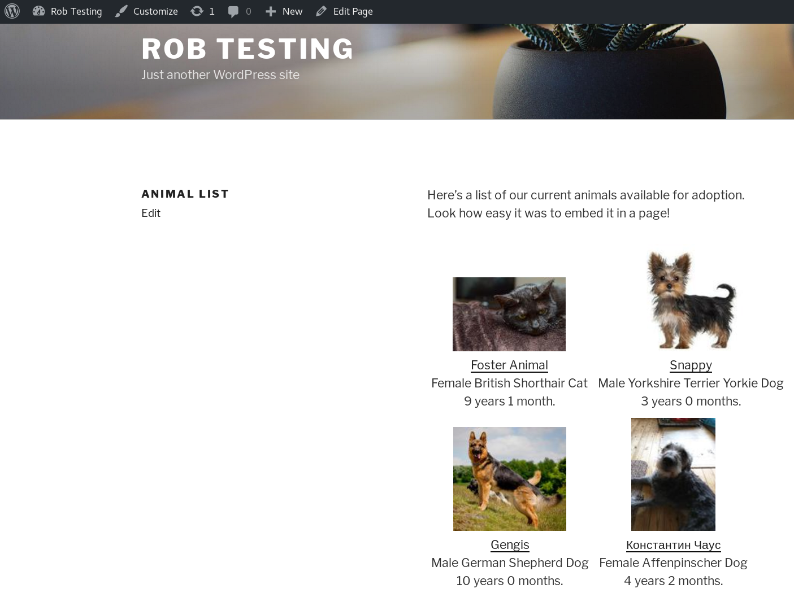

.. _websiteintegration:

Appendix: Integrating with Your Website
=======================================

ASM offers a number of methods of integrating your adoptable animal data with
your website.

Javascript Include
------------------

The animal_view_adoptable_js method of ASM's :ref:`serviceapi`
can generate a list of adoptable animal thumbnails for embedding straight into
a div container on a page of your website. 

Clicking on the thumbnails will call the animal_view method of the Service API
for the animal. You can edit the HTML of how that page looks and what
information appears on it by editing the animal_view template under
:menuselection:`Publishing --> Edit HTML publishing templates`

The code snippet required to embed the adoptable animal list in a page on your
website looks like this::
    
    

    

This example is for sheltermanager.com, substitute your own URL in the script
src if you are hosting ASM yourself. Also, if you are using sheltermanager.com,
change ACCOUNT in the src for your sheltermanager.com account.

Wordpress
^^^^^^^^^

To embed your adoptable animals in a Wordpress page, edit the page and add the
javascript include snippet shown above where you'd like your adoptable animals
to appear on the page:

.. image:: images/wordpress_1.png

Facebook
^^^^^^^^

The "Share" button on animal records is great for highlighting an animal so that
all your followers see it in their timeline, but you can also add your complete
adoptable animal list as a tab to your Facebook page too.

Follow this guide: https://www.jotform.com/help/82-adding-a-form-to-facebook-using-custom-iframe-app/
to add a new iframe tab to your page. You can use a service call to ASM as the iframe target
to get a list of your adoptable animals.

If you're using sheltermanager.com, it's as easy as using this snippet of
iframe markup (substitute YOURACCOUNT for your sheltermanager.com account
number):

   <frame src="https://service.sheltermanager.com/asmservice?method=animal_view_adoptable_html&account=YOURACCOUNT" width="100%" height="600px"></iframe>

Dynamic HTML Page 
-----------------

ASM can generate dynamic pages of your adoptable animals on demand with the
service API. The HTML templates are those used by the regular HTML publisher.

For example, to embed a dynamic page of adoptable animals in an iframe on your
website for a sheltermanager.com account::

    <iframe src="https://service.sheltermanager.com/asmservice?account=ACCOUNT&method=html_adoptable_animals" width="100%" height="600px"></iframe>

Static HTML Pages (Publisher)
-----------------------------

ASM can generate a set of static pages from your data with its 
:ref:`htmlftppublisher`. You can configure it under
:menuselection:`Publishing --> Set Publishing Options --> HTML/FTP Publisher`.

The HTML/FTP publisher constructs the static pages using HTML templates, which
you can create under :menuselection:`Publishing --> Edit HTML publishing
templates` and outputs the pages to a folder of your choice, sending them on to
an FTP server of your choice.

Once the site has been created, you can either link directly to it, or embed it
on your website with an iframe tag.

.. warning:: The HTML publisher is no longer available for sheltermanager.com users, use the dynamic HTML page service call outlined above instead.

Service API Data Calls
----------------------

Finally, you can use ASM's Service API to retrieve the adoptable animal
information and images programatically yourself and use that information to
construct a site in any way you wish. 

More information can be found in the section on the :ref:`serviceapi`

